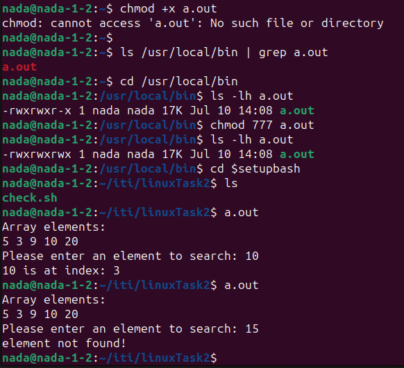

## Part 1
# vi Editor Cheat Sheet

The `vi` editor is a powerful text editor available on Unix-like systems. It operates in various modes, primarily the Command mode and Insert mode, allowing efficient text editing and navigation. Below are common commands and their descriptions.

## Basic Commands
- `$ vi <filename>` — Open or edit a file.
- `i` — Switch to Insert mode.
- `Esc` — Switch to Command mode.
- `:w` — Save and continue editing.
- `:wq` or `ZZ` — Save and quit/exit `vi`.
- `:q!` — Quit `vi` and do not save changes.

## Text Manipulation
- `yy` — Yank (copy) a line of text.
- `p` — Paste a line of yanked text below the current line.
- `o` — Open a new line under the current line.
- `O` — Open a new line above the current line.
- `A` — Append to the end of the line.
- `a` — Append after the cursor’s current position.
- `I` — Insert text at the beginning of the current line.
- `b` — Go to the beginning of the word.
- `e` — Go to the end of the word.
- `x` — Delete a single character.
- `dd` — Delete an entire line.
- `Xdd` — Delete X number of lines.
- `Xyy` — Yank X number of lines.

## Navigation
- `G` — Go to the last line in a file.
- `XG` — Go to line X in a file.
- `gg` — Go to the first line in a file.
- `:num` — Display the current line’s line number.
- `h` — Move left one character.
- `j` — Move down one line.
- `k` — Move up one line.
- `l` — Move right one character.

## General Description of the vi Editor
The `vi` editor is a versatile and powerful text editor widely used in Unix-like operating systems. It has two primary modes of operation:

- **Command Mode**: This is the default mode when you open `vi`. In this mode, you can navigate the text, delete text, yank (copy) and paste text, and perform various other operations. To execute a command, simply type the appropriate keystroke or command sequence.

- **Insert Mode**: In this mode, you can insert and modify text. To enter Insert mode, press `i`, `a`, `o`, or `O` from Command mode. To return to Command mode, press `Esc`.

The `vi` editor is known for its efficiency, allowing users to perform complex text manipulations with minimal keystrokes. It's especially useful for editing configuration files and programming scripts, making it a valuable tool for developers and system administrators.


# Why the Binary Can Be Executed from Any Location

## PATH Environment Variable
The `PATH` variable specifies directories where executables are located. You can view it using:
```sh
echo $PATH
```

### Example output:
```sh
/usr/local/sbin:/usr/local/bin:/usr/sbin:/usr/bin:/sbin:/bin
```
This shows `/usr/local/bin` is included in the search paths.

## Global Availability
Moving the binary to `/usr/local/bin` makes it accessible to all users and shell sessions, regardless of the current working directory.

## Execution from Any Directory
When you type `my_program`, the shell searches directories in `PATH`, finds it in `/usr/local/bin`, and executes it.





## Part 2
# Shell and Environment Variable Tasks

## 1. List the available shells in the system
Listing the available shells by using the following command:
```sh
cat /etc/shells
```
## 2. List the environment variables in the current shell
Listing all environment variables in the current shell by using the command:
```sh
printenv
```

Alternatively using:
```sh
env
```

## 3. Display your current shell name
Displaying the name of the current shell using the command:
```sh
echo $SHELL
```

## 4. Execute the following command:
By executing the command below:
```sh
echo \
```
Then pressing Enter after the backslash `\`.
so:
### So: purpose of `\`
The backslash `\` is an escape character in Unix-like systems. When used at the end of a line, it indicates that the command continues on the next line. It effectively allows you to split a long command over multiple lines for better readability.

## 5. Create a Bash shell alias named `PrintPath` for the `echo $PATH` command
To create a Bash shell alias
1)Add this line to `.bashrc` or `.bash_profile` file:
```sh
alias PrintPath='echo $PATH'
```
so here we add an alias to our bash shell
2)Apply or verify the changes by sourcing the file:
```sh
source ~/.bashrc
```

now by using `PrintPath` i could print the `PATH` environment variable:
```sh
PrintPath
```
