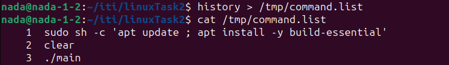

### Q1) Script Description

This section describes a script that modifies the `.bashrc` file to set environment variables and prints a local variable when a new terminal is opened. It also opens a new GNOME terminal.

#### Script Breakdown

#### Shebang
```bash
#!/bin/bash
```
Specifies the script should be run using the Bash shell.

#### Check for .bashrc File
```bash
if [ -f "$HOME/.bashrc" ]; then
```
Checks if the `.bashrc` file exists in the user's home directory.

#### Append HELLO Environment Variable
```bash
echo "export HELLO=\$HOSTNAME" >> "$HOME/.bashrc"
```
Appends an environment variable `HELLO` with the value of `HOSTNAME` to the `.bashrc` file.

#### Append LOCAL Variable
```bash
echo "LOCAL=\$(whoami)" >> "$HOME/.bashrc"
```
Appends a local variable `LOCAL` with the value of the `whoami` command to the `.bashrc` file.

#### Print LOCAL Variable
```bash
echo "echo LOCAL=\$LOCAL" >> "$HOME/.bashrc"
```
Adds a command to print the `LOCAL` variable when opening a new terminal. This line prints `LOCAL=username` where `username` is the output of the `whoami` command.

#### End of if Statement
```bash
fi
```
Ends the `if` statement.

#### Open New Terminal
```bash
gnome-terminal &
```
Opens a new GNOME terminal in the background.

#### What Happens When the Terminal is Opened

When a new terminal is opened, the `.bashrc` file is sourced, which means all the commands and variable assignments in `.bashrc` are executed. In this case, it will:

1. Set the environment variable `HELLO` to the value of the `HOSTNAME` environment variable.
2. Set the local variable `LOCAL` to the username of the current user (output of the `whoami` command).
3. Print the string `LOCAL=username` to the terminal, where `username` is the current user's username.

### Q2) Command to Retrieve Command History

This command retrieves the command history using the `history` command and redirects the output to the file `/tmp/commands.list`:

```bash
history > /tmp/commands.list
```



