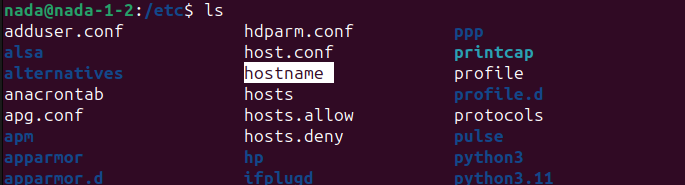

# Commands and Shell Basics

### Q1) Script Description

This section describes a script that modifies the `.bashrc` file to set environment variables and prints a local variable when a new terminal is opened. It also opens a new GNOME terminal.

#### Script Breakdown

##### Shebang
```bash
#!/bin/bash
```
Specifies the script should be run using the Bash shell.

##### Check for .bashrc File
```bash
if [ -f "$HOME/.bashrc" ]; then
```
Checks if the `.bashrc` file exists in the user's home directory,
And the -f option in the if statement checks if .bashrc file exists in my home directory

##### Append HELLO Environment Variable
```bash
echo "export HELLO=\$HOSTNAME" >> "$HOME/.bashrc"
```
`export HELLO=\$HOSTNAME`: This sets an environment variable named HELLO 



to the value of the environment variable `HOSTNAME>> "$HOME/.bashrc"`: 
This appends the output of the echo command to the `.bashrc` file in the user's home directory.

##### Append LOCAL Variable
```bash
echo "LOCAL=\$(whoami)" >> "$HOME/.bashrc"
```
Appends a local variable `LOCAL` with the value of the `whoami` command to the `.bashrc` file,
And the backslash (\) before the dollar sign ($) ensures that the dollar sign is treated as a literal character in the echo command, so that whoami is not executed when the echo command is run.

##### Print LOCAL Variable
```bash
echo "echo LOCAL=\$LOCAL" >> "$HOME/.bashrc"
```
Adds a command to print the `LOCAL` variable when opening a new terminal. This line prints `LOCAL=username` where `username` is the output of the `whoami` command.


##### End of if Statement
```bash
fi
```
Ends the `if` statement.

##### Open New Terminal
```bash
gnome-terminal &
```
Opens a new GNOME terminal in the background.
The command gnome-terminal & is used to open a new GNOME terminal window in the background.
&: This symbol runs the preceding command in the background.

#### What Happens When the Terminal is Opened

When a new terminal is opened, the `.bashrc` file is sourced, which means all the commands and variable assignments in `.bashrc` are executed. In this case, it will:

1. Set the environment variable `HELLO` to the value of the `HOSTNAME` environment variable.
2. Set the local variable `LOCAL` to the username of the current user (output of the `whoami` command).
3. Print the string `LOCAL=username` to the terminal, where `username` is the current user's username.


### Q2) Command to Retrieve Command History

This command retrieves the command history using the `history` command and redirects the output to the file `/tmp/commands.list`:

```bash
history > /tmp/commands.list
```


### Q3) Edit Profile and Count Words/Files

#### 2. Edit Profile to Display Date at Login and Change Prompt Permanently

Add the following line to your `.bashrc` or `.bash_profile`:

```bash
echo 'export PS1="\[\e[32m\]\u@\h \[\e[34m\]\w \[\e[35m\]\$(date "+%Y-%m-%d") \[\e[0m\]$ "' >> ~/.bashrc
source ~/.bashrc
```

#### 3. Commands for Counting Words and Files

To count the number of words in a file:

```sh
wc -w < filename
```
To count the number of files in a directory:

```sh
ls -l | grep "^-" | wc -l
```

To count the number of user commands in the history file:

```sh
history | wc -l
```


### Q4) Command Execution Examples

#### a. `cat filename1 | cat filename2`

This command will output the contents of `filename1`, which will then be piped as input to `cat filename2`. Essentially, it will display the contents of `filename1`.


#### b. `ls | rm`

This command will attempt to remove all files listed by `ls`. However, it will fail because `rm` expects filenames as arguments, not input from a pipe.


#### c. `ls /etc/passwd | wc -l`

This command lists the file `/etc/passwd` and pipes the output to `wc -l`, which counts the number of lines in the output. Since `ls` outputs a single line for `/etc/passwd`, `wc -l` will output `1`.


### Q5) Search for Files Named ".profile"

To search for all files on the system named `.profile`:

```sh
find / -name ".profile" 2>/dev/null
```
This command searches from the root directory / for files named .profile


### Q6) List Inode Numbers

An inode (index node) is a data structure used by many file systems to store information about a file or a directory.
such as:
-File size
-Ownership (user and group)
-Permissions (read, write, execute)
-Timestamps (creation, modification, access)
-Link count (number of hard links pointing to the inode)
-Pointers to the data blocks where the file’s actual content is stored

as a key point about inode
Directories as Files: Directories are special types of files that contain mappings between file names and inode numbers.

```sh
file1.txt  ->  inode 12345
file2.txt  ->  inode 12346
```

To list the inode numbers of `/`, `/etc`, and `/etc/hosts`:

```sh
ls -i / /etc /etc/hosts
```


### Q7) Create Links

#### a. Create a Symbolic Link

Create a symbolic link of `/etc/passwd` in `/boot`:

```sh
ln -s /etc/passwd /boot/passwd_link
```


#### b. Create a Hard Link

You cannot create a hard link of `/etc/passwd` in `/boot` because hard links cannot span across different file systems. Both the source and destination must be on the same file system.


### Q8) Change the Continuation Prompt

When using backslashes (`\`) in an `echo` command, it continues the command to the next line and prompts with `>`. To change this continuation prompt from `>` to `:`, set the `PS2` variable in your shell configuration file:

```sh
echo 'PS2=":"' >> ~/.bashrc
source ~/.bashrc
```


### Q9) Additional Prompt Customization (PS1)

### Customizing the PS1 Prompt

The `PS1` variable in Unix-like operating systems defines the primary prompt string, which is displayed when the shell is ready to read a command from the user. Customizing `PS1` allows you to modify the appearance of the command prompt.

#### Common Escape Sequences

- `\u`: Username
- `\h`: Hostname (up to the first dot)
- `\w`: Current working directory
- `\W`: Basename of the current working directory
- `\d`: Current date
- `\t`: Current time (24-hour format)
- `\@`: Current time (12-hour format with am/pm)
- `\n`: Newline
- `\$`: Displays `#` for root or `$` for regular users

#### Examples

**Basic Prompt:**

```sh
PS1='\u@\h:\w\$ '
# Example: user@hostname:/current/directory$
```

**Colorful Prompt:**

```sh
PS1='\[\e[32m\]\u@\h:\[\e[34m\]\w\[\e[0m\]\$ '
# Username and hostname in green, current directory in blue
```

**Including Date and Time:**

```sh
PS1='\[\e[35m\]\d \t \[\e[32m\]\u@\h:\w\[\e[0m\]\$ '
# Example: Tue Jul 09 14:30:00 user@hostname:/current/directory$
```

#### Making it Permanent

To make your custom prompt permanent, add the `PS1` assignment to your shell's configuration file (e.g., `.bashrc` or `.bash_profile`):

```sh
echo 'PS1="\[\e[35m\]\d \t \[\e[32m\]\u@\h:\w\[\e[0m\]\$ "' >> ~/.bashrc
source ~/.bashrc
```