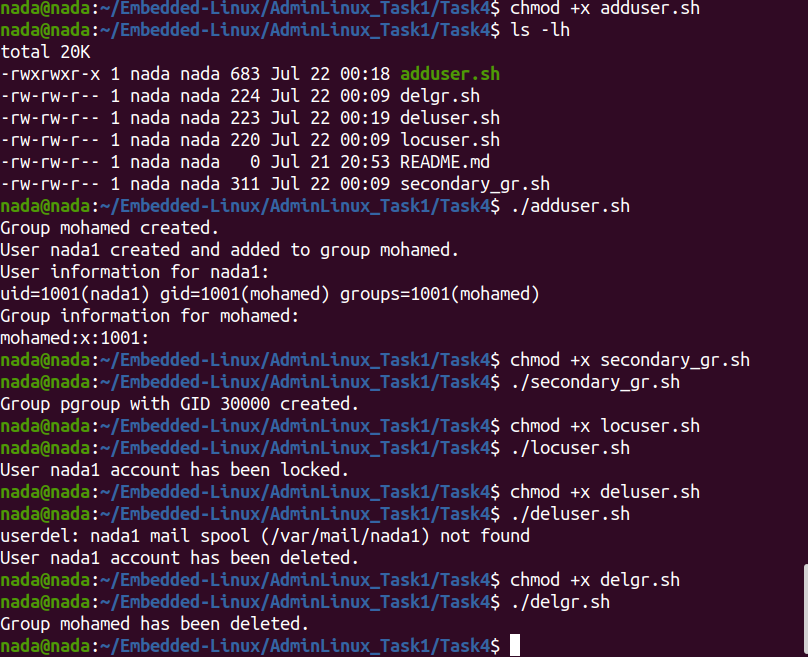

# Task 4: User and Group Management with Bash Scripts

Welcome to Task 4 of the Embedded Linux Administration series! This task involves creating and managing users and groups using Bash scripts. Below, I provide detailed instructions for each step, including checking for existing users and groups, and handling screenshots in Ubuntu.

## Table of Contents

1. [Creating a User and Adding to a Group](#creating-a-user-and-adding-to-a-group)
2. [Creating a Secondary Group](#creating-a-secondary-group)
3. [Locking a User Account](#locking-a-user-account)
4. [Deleting a User Account](#deleting-a-user-account)
5. [Deleting a Group](#deleting-a-group)
6. [Difference Between `adduser` and `useradd`](#difference-between-adduser-and-useradd)
7. [Running](#running)

## Creating a User and Adding to a Group

First, I create a user named `yourName` and add them to the `FamilyName` group. Here's how I do it:

```bash
#!/bin/bash

USER_NAME="yourName"
GROUP_NAME="FamilyName"

# Check if group exists, if not, create it
if getent group "$GROUP_NAME" >/dev/null; then
  echo "Group $GROUP_NAME already exists."
else
  sudo groupadd "$GROUP_NAME"
  echo "Group $GROUP_NAME created."
fi

# Check if user exists, if not, create it and add to group
if id "$USER_NAME" &>/dev/null; then
  echo "User $USER_NAME already exists."
else
  sudo useradd -m -g "$GROUP_NAME" "$USER_NAME"
  echo "User $USER_NAME created and added to group $GROUP_NAME."
fi

# Display user and group information
echo "User information for $USER_NAME:"
id "$USER_NAME"
echo "Group information for $GROUP_NAME:"
getent group "$GROUP_NAME"
```

**Explanation**:

- `getent`: getent stands for "get entries." It is a command used to query entries from various administrative databases configured in the /etc/nsswitch.conf file. These databases include:

    passwd: User account information.
    group: Group account information.
    hosts: Host names and IP addresses.
    services: Network services.
    protocols: Network protocols.
    networks: Network names and addresses.
    ethers: Ethernet addresses.
so it allows me to query these databases to retrieve specific entries, based on that
`getent group "$GROUP_NAME" >/dev/null`: Checks if the group exists. If it does, no output is produced; if not, it exits with a non-zero status.
-`/dev/null`: is a special file in Unix-like operating systems that discards all data written to it. It is often referred to as the "null device" or "bit bucket." 
so this special file that discards all data written to it, often used to suppress command output.
- Redirection operators:
  - `>`: Redirects standard output (stdout) to a file or device.
  - `2>`: Redirects standard error (stderr) to a file or device.
  - `&>`: Redirects both stdout and stderr to a file or device.
- How it works: (e.g. `id "$USER_NAME" &>/dev/null`) Checks if the user exists. If it does, the command produces no output; if not, it exits with a non-zero status.

## Creating a Secondary Group

Next, I create a supplementary (secondary) group called `pgroup` with a group ID of 30000:

```bash
#!/bin/bash

GROUP_NAME="pgroup"
GROUP_ID="30000"

# Check if group exists, if not, create it with specific GID
if getent group "$GROUP_NAME" >/dev/null; then
  echo "Group $GROUP_NAME already exists."
else
  sudo groupadd -g "$GROUP_ID" "$GROUP_NAME"
  echo "Group $GROUP_NAME with GID $GROUP_ID created."
fi
```

## Locking a User Account

To lock the user account so that they can't log in, I use the following script:

```bash
#!/bin/bash

USER_NAME="yourName"

# Lock user account
if id "$USER_NAME" &>/dev/null; then
  sudo usermod -L "$USER_NAME"
  echo "User $USER_NAME account has been locked."
else
  echo "User $USER_NAME does not exist."
fi
```

**Explanation**:

- `usermod -L "$USER_NAME"`: Locks the user account by placing a '!' in front of the encrypted password in the `/etc/shadow` file, effectively disabling the password.

## Deleting a User Account

To delete a user account, I use this script:

```bash
#!/bin/bash

USER_NAME="yourName"

# Delete user account
if id "$USER_NAME" &>/dev/null; then
  sudo userdel -r "$USER_NAME"
  echo "User $USER_NAME account has been deleted."
else
  echo "User $USER_NAME does not exist."
fi
```

## Deleting a Group

Finally, to delete a group, I use this script:

```bash
#!/bin/bash

GROUP_NAME="FamilyName"

# Delete group
if getent group "$GROUP_NAME" >/dev/null; then
  sudo groupdel "$GROUP_NAME"
  echo "Group $GROUP_NAME has been deleted."
else
  echo "Group $GROUP_NAME does not exist."
fi
```

## Difference Between `adduser` and `useradd`

The `useradd` command is a low-level utility for adding users. It requires several options to be specified manually and does not create home directories by default. The `adduser` command is a higher-level utility that is more user-friendly. It interactively prompts for the necessary information and creates the home directory by default.

### Example:

Using `useradd`:
```bash
sudo useradd -m -g FamilyName yourName
```

Using `adduser`:
```bash
sudo adduser yourName --ingroup FamilyName
```

## Running

To run the scripts, make sure they have executable permissions. For example:

```bash
chmod +x adduser.sh
./adduser.sh
```

## Adding a Picture

To add a picture to this README, use the following markdown syntax:

```markdown

```

For example, if I have an image named `01.png` in the same directory as this README file, I would add it like this:

