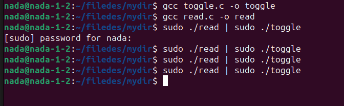

# Brightness Toggle Program

This repository contains two C programs that work together to read and toggle the brightness of the Caps Lock LED on my keyboard.

## Files

1. **read_brightness.c**: This program reads the current brightness value of the Caps Lock LED and prints it to the standard output.
2. **toggle_brightness.c**: This program reads the brightness value from the standard input and toggles the brightness value.

## Compilation

To compile the programs, use `gcc`:

```bash
gcc read_brightness.c -o read_brightness 
gcc toggle_brightness.c -o toggle_brightness 
```

## Usage

Here I needed to have superuser (root) privileges to modify the brightness file, so I used `sudo` to run the programmes. 


### Step-by-Step Execution

1. **Read the Brightness Value**:
    ```bash
    sudo ./read_brightness
    ```

    This command will print the current brightness value (`0` or `1`) of the Caps Lock LED.

2. **Toggle the Brightness Value**:
    ```bash
    echo 0 | sudo ./toggle_brightness
    ```

    This command will toggle the brightness value. For example, if the current value is `0`, it will change it to `1`, and vice versa.

### Using Piping

To read the current brightness value and immediately toggle it using piping, run:

```bash
sudo ./read_brightness | sudo ./toggle_brightness
```

This command will:
1. Run `read_brightness` to read the current brightness value and print it to the standard output.
2. Pipe the output of `read_brightness` to `toggle_brightness`.
3. Run `toggle_brightness` to read the value from the standard input, toggle it, and write the new value back to the brightness file.


