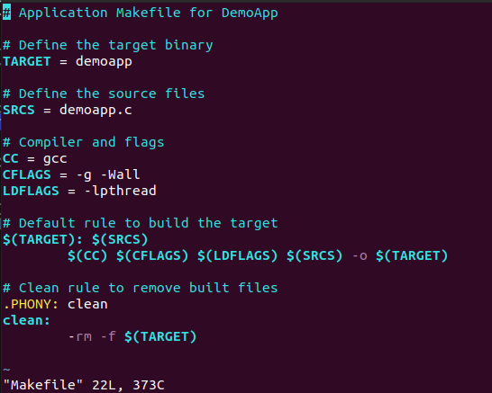
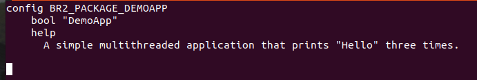

Here's an introduction added to the content without changing anything else:

---

# Buildroot Configuration and Package Integration Guide

This guide will walk you through the process of configuring Buildroot and integrating a new package. The steps include installing necessary libraries, downloading Buildroot, configuring Buildroot settings, and creating a simple multithreaded application named `DemoApp`. You will learn how to add this application to Buildroot, configure it, and build the root filesystem. Finally, you will run the system using QEMU.

---

### Download Required Libraries

To begin, install the necessary libraries and tools:

```sh
sudo apt install sed make binutils gcc g++ bash patch \
gzip bzip2 perl tar cpio python unzip rsync wget libncurses-dev
```

### Download Buildroot

Clone the Buildroot repository:

```sh
git clone https://github.com/buildroot/buildroot.git
cd buildroot
```

### Configure Buildroot

```sh
make menuconfig
```

In the configuration menu, we will set up the following:

- **Init Process**: Choose between System V, systemd, or BusyBox init.

  - If using systemd, remember to increase the root filesystem size in the Buildroot configuration. Here I chose `systemV` @ system configuration

  

  - @ Interpreter languages and scripting I chose `python3`

  

  - @ Shell and utilities I chose `bash`

  

  - @ Text editors and viewers I chose `nano` and `vim`

  

**Now lets open the open qemu at buildroot:**


---

# Buildroot Task
# Buildroot Configuration and Package Integration Guide

## Steps to Add a New Package in Buildroot

### 1. Create the Application (DemoApp)

Create a simple multithreaded application named `DemoApp`, which prints "Hello" three times. This application demonstrates basic multithreading using the `pthread` library.

### 1. Set Up Buildroot Package Directory
Navigate to the Buildroot package directory and create a directory for your package. This is where you will place your source code and Makefile.

```sh
cd path/to/buildroot/package
mkdir demoapp
cd demoapp
touch demoapp.c Makefile demoapp.mk Config.in 
```


### 1. Create the Application demoapp
**DemoApp.c:**

```c
#include <stdio.h>
#include <pthread.h>

void *print_hello(void *arg) {
    for (int i = 0; i < 3; ++i) {
        printf("Hello\n");
    }
    return NULL;
}

int main() {
    pthread_t thread;

    // Create a new thread
    pthread_create(&thread, NULL, print_hello, NULL);

    // Wait for the thread to finish
    pthread_join(thread, NULL);

    return 0;
}
```


### 3. Create the Application Makefile

To compile `DemoApp`, create a Makefile that defines how to build the application and handle cleanup.

**Makefile:**

```makefile
# Application Makefile for DemoApp

# Define the target binary
TARGET = demoapp

# Define the source files
SRCS = DemoApp.c

# Compiler and flags
CC = gcc
CFLAGS = -g -Wall
LDFLAGS = -lpthread

# Default rule to build the target
$(TARGET): $(SRCS)
	$(CC) $(CFLAGS) $(LDFLAGS) $(SRCS) -o $(TARGET)

# Clean rule to remove built files
.PHONY: clean
clean:
	-rm -f $(TARGET)
```



### 4. Create the `Config.in` File

The `Config.in` file defines the configuration options for your package in the Buildroot configuration menu, allowing users to enable or disable the package.

**Config.in:**

```sh
config BR2_PACKAGE_DEMOAPP
    bool "DemoApp"
    help
      A simple multithreaded application that prints "Hello" three times.
```



### 5. Create the `demoapp.mk` File

The `demoapp.mk` file contains the build instructions for your package. It defines how to build and install the `DemoApp` application.

**demoapp.mk:**

```sh
################################################################################
#
# DemoApp package
#
################################################################################

DEMOAPP_VERSION = 1.0
DEMOAPP_SITE = $(TOPDIR)/package/demoapp/src
DEMOAPP_SITE_METHOD = local

# Specify that we are using a custom Makefile
define DEMOAPP_BUILD_CMDS
	$(MAKE) -C $(@D) CC="$(TARGET_CC)" CFLAGS="$(TARGET_CFLAGS)" LDFLAGS="$(TARGET_LDFLAGS)"
endef

define DEMOAPP_INSTALL_TARGET_CMDS
	$(INSTALL) -D -m 0755 $(@D)/demoapp $(TARGET_DIR)/usr/bin/demoapp
endef

# Register the package with Buildroot
$(eval $(generic-package))
```


### 6. Edit the Main `Config.in` File

To include your package in the Buildroot menu, modify the main `Config.in` file in the package directory. This step ensures that your package appears in the Buildroot configuration menu.

**Main Config.in:**

Add the following line in the appropriate section (e.g., under "Target packages"):

```sh
menu "DEMOAPP Packages"
    source "package/demoapp/Config.in"
endmenu
```


### 7. Add the Package to `package/Config.in`

Ensure that your package is listed in `package/Config.in` so that it is included in the Buildroot configuration.

### 8. Configure Buildroot

Run the Buildroot configuration menu to select and configure your package and other build options:

```sh
make menuconfig
```


### 9. Build the Root Filesystem

After configuring Buildroot, build the root filesystem to include your package:

```sh
make
```


### 10. Run the System with QEMU

To run the system using QEMU, use the `./start-qemu` script provided by Buildroot. This script will start a QEMU virtual machine with the generated root filesystem:

```sh
./start-qemu
```