The `.bb` recipe defines how to extract and run the executable on the machine (rootfs) sequentially. As described previously, it involves cloning the layer, creating a `downloads` directory, unpacking in the `S` directory, patching in the `S` directory, configuring in the `S` directory, building in the `B` directory, and finally installing (collecting files, features, or apps) in the `D` directory. 

- `S` -> Source directory
- `B` -> Build directory
- `D` -> Destination directory

These are local variables.

To create a `.bb` file, follow these steps:

1. It should be in a layer, but make sure it is not in the `meta` layer or any layer belonging to OpenEmbedded. You cannot use any layer from here.

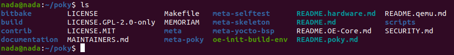

To add or edit, do not modify OpenEmbedded or Yocto layers as it's a design principle. If you want to add or edit, do it in your created external layer and then add a license.

To create your own layer, refer to the structure of Poky layers.

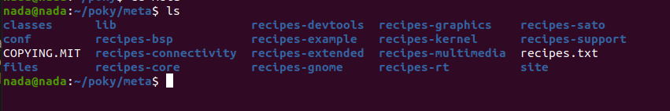

Layers contain classes, configuration files, libraries, and recipes.

To create a layer, it must be outside of Poky and anything related to OpenEmbedded or third-party layers.

As I cloned Poky, I cannot edit it to maintain Yocto hierarchy.

So, what now? Should we create the layer and do everything ourselves? No, there is a better way:

Navigate to: `cd /poky/bitbake`

As we used `bitbake-getvar`:

```sh
cd /bin
bitbake-getvar --help
```

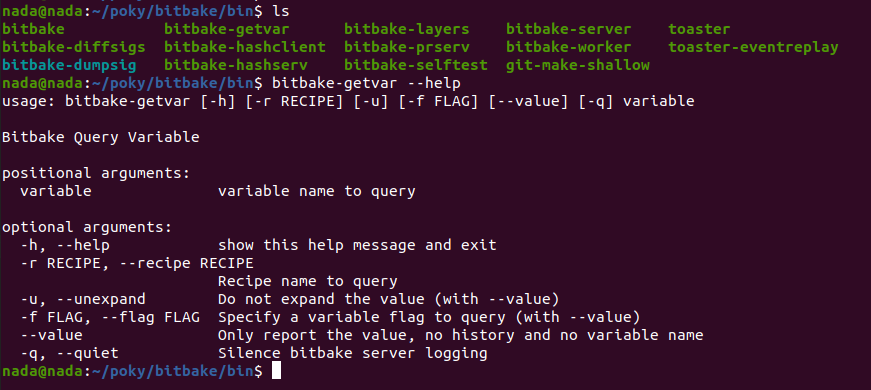

There is a command to help create a template structure to assist in completing the creation based on this structure.

Yes, there is: `bitbake-layers --help`.

What does it do? As you see, it has subcommands like `show-recipes`, `show-appends`, etc., and one of them is `create-layer`.

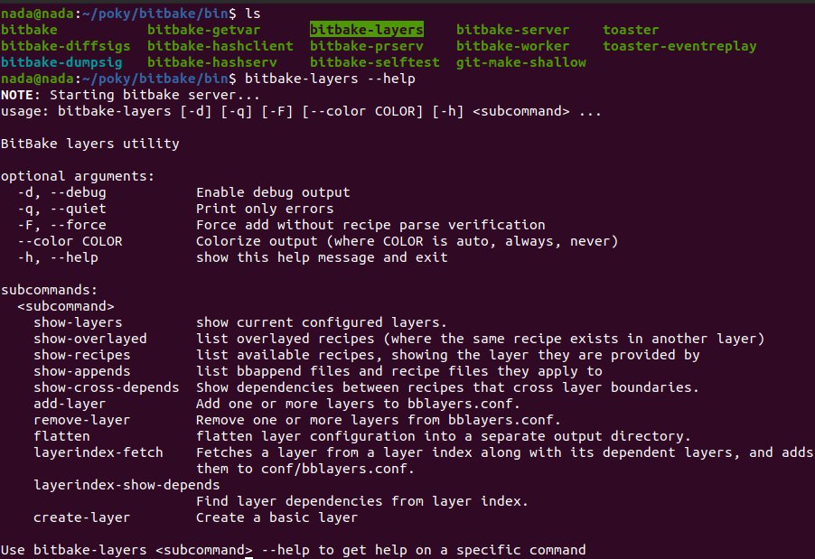

Let's do that. Again, don't forget the layer you create must be outside Poky.

You will see a complete structure created (template of the layer).

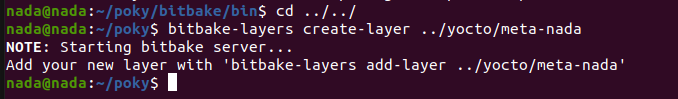
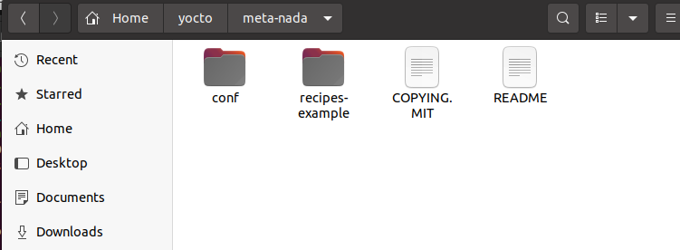

As you can see, it has all the `.conf` files, including `layer.conf`.

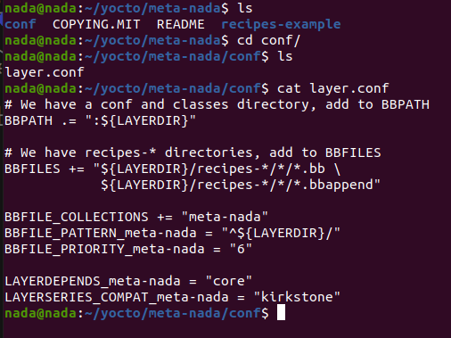

Since we cloned Kirkstone previously, Yocto does it by itself, making my layer compatible with Kirkstone.

Additionally, it makes my layer depend on the core (which is meta-core). It's okay to depend on another layer.

Let's make sure:

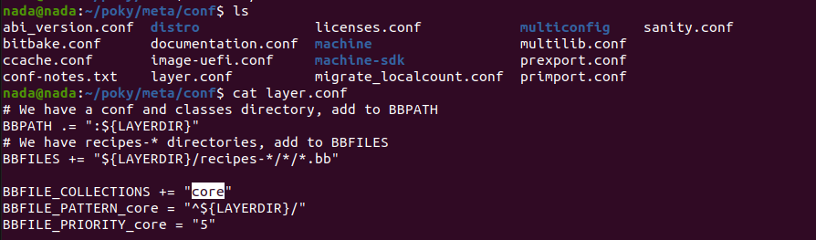

So, it names the core. Based on that, you can change your layer name:

```sh
cd /yocto/meta-nada
vim layer.conf
```

You can change this part:

```sh
BBFILE_COLLECTIONS += "nada"
BBFILE_PATTERN_nada = "^${LAYERDIR}/"
BBFILE_PRIORITY_nada = "6"
```

Ensure the layer priority is set correctly as it's important for recipes.

Now, let's edit the recipe (regular file, not executable).

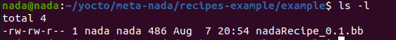

As `-rw-rw-r--`, the first '-' means this is a regular file.

Bitbake will run this recipe. 

It already exists here:

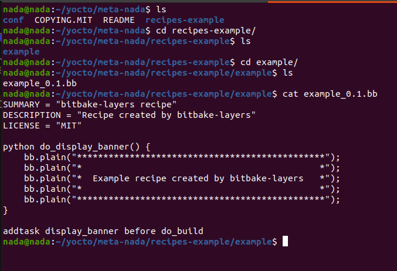

Rename it:

```sh
mv example_0.1.bb nadaRecipe_0.1.bb # as _0.1 is the recipe version
```

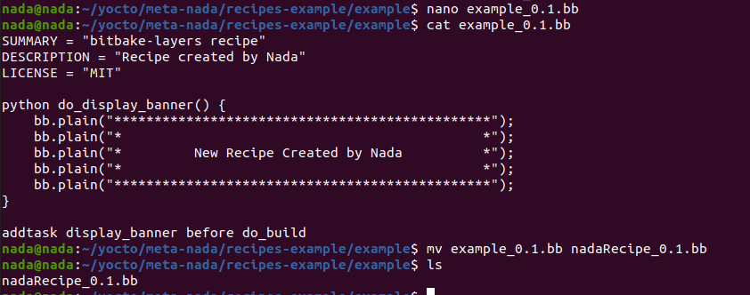

Navigate again in the hierarchy shown in `BBFILES`:

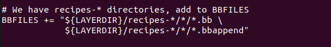

BBFILES searches for recipes in:
1. `recipes-*`
2. `/*`
3. `*.bb`

This variable represents how to find your recipe inside your layer.

```sh
SUMMARY = "bitbake-layers recipe"
DESCRIPTION = "Recipe created by Nada"
LICENSE = "MIT"

python do_display_banner() {
    bb.plain("***********************************************");
    bb.plain("*                                             *");
    bb.plain("*         New Recipe Created by Nada          *");
    bb.plain("*                                             *");
    bb.plain("***********************************************");
}

addtask display_banner before do_build
```

To dive into this point:
Create a recipe directory separate from `recipes-example`:

```sh
cd ~/yocto/meta-nada
mkdir nada-recipes
cd nada-recipes/
touch nadaRecipe_0.1.bb
```

Append this recipe now to the `local.conf` file, specifically `BBFILES`:

```sh
BBFILES:append = " ${LAYERDIR}/nada-*/*.bb" # keep a space after the double quote as append doesn't add space
```

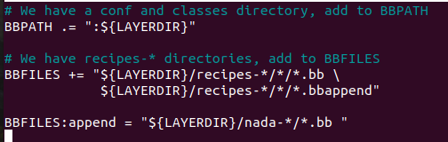

Now we add a new hierarchy.

Run this recipe by:
`bitbake nadaRecipe`

This means bitbake takes input (.bb file). It parses `.conf` first to locate all your recipes.

It will give an error `Nothing PROVIDES nadaRecipe_0.1`:

You should add your layer in `BBlayers.conf` to include all layers you want in your build system.

Shown here:


Edit `bblayer.conf` and add your "absolute path":

```sh
vim bblayer.conf
```

or

```sh
cd ~/poky/build
bitbake-layers add-layer ~/yocto/meta-nada/ # can add relative path here
```

Check its existence:

```sh
bitbake-layers show-layers
```

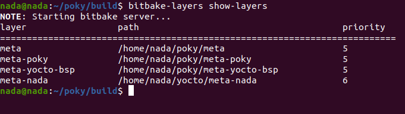

Now, let's run our recipe again:

