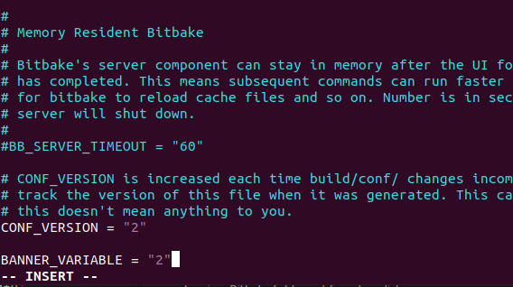

The `.bb` recipe defines how to extract and run the executable on the machine (rootfs) sequentially. As described previously, it involves cloning the layer, creating a `downloads` directory, unpacking in the `S` directory, patching in the `S` directory, configuring in the `S` directory, building in the `B` directory, and finally installing (collecting files, features, or apps) in the `D` directory. 

- `S` -> Source directory
- `B` -> Build directory
- `D` -> Destination directory

These are local variables.

To create a `.bb` file, follow these steps:

1. It should be in a layer, but make sure it is not in the `meta` layer or any layer belonging to OpenEmbedded. You cannot use any layer from here.


To add or edit, do not modify OpenEmbedded or Yocto layers as it's a design principle. If you want to add or edit, do it in your created external layer and then add a license.

To create your own layer, refer to the structure of Poky layers.


Layers contain classes, configuration files, libraries, and recipes.

To create a layer, it must be outside of Poky and anything related to OpenEmbedded or third-party layers.

As I cloned Poky, I cannot edit it to maintain Yocto hierarchy.

So, what now? Should we create the layer and do everything ourselves? No, there is a better way:

Navigate to: `cd /poky/bitbake`

As we used `bitbake-getvar`:

```sh
cd /bin
bitbake-getvar --help
```


There is a command to help create a template structure to assist in completing the creation based on this structure.

Yes, there is: `bitbake-layers --help`.

What does it do? As you see, it has subcommands like `show-recipes`, `show-appends`, etc., and one of them is `create-layer`.


Let's do that. Again, don't forget the layer you create must be outside Poky.

You will see a complete structure created (template of the layer).


As you can see, it has all the `.conf` files, including `layer.conf`.


Since we cloned Kirkstone previously, Yocto does it by itself, making my layer compatible with Kirkstone.

Additionally, it makes my layer depend on the core (which is meta-core). It's okay to depend on another layer.

Let's make sure:


So, it names the core. Based on that, you can change your layer name:

```sh
cd /yocto/meta-nada
vim layer.conf
```

You can change this part:

```sh
BBFILE_COLLECTIONS += "nada"
BBFILE_PATTERN_nada = "^${LAYERDIR}/"
BBFILE_PRIORITY_nada = "6"
```

Ensure the layer priority is set correctly as it's important for recipes.

Now, let's edit the recipe (regular file, not executable).


As `-rw-rw-r--`, the first '-' means this is a regular file.

Bitbake will run this recipe. 

It already exists here:


Rename it:

```sh
mv example_0.1.bb nadaRecipe_0.1.bb # as _0.1 is the recipe version
```


Navigate again in the hierarchy shown in `BBFILES`:


BBFILES searches for recipes in:
1. `recipes-*`
2. `/*`
3. `*.bb`

This variable represents how to find your recipe inside your layer.

```sh
SUMMARY = "bitbake-layers recipe"
DESCRIPTION = "Recipe created by Nada"
LICENSE = "MIT"

python do_display_banner() {
    bb.plain("***********************************************");
    bb.plain("*                                             *");
    bb.plain("*         New Recipe Created by Nada          *");
    bb.plain("*                                             *");
    bb.plain("***********************************************");
}

addtask display_banner before do_build
```

To dive into this point:
Create a recipe directory separate from `recipes-example`:

```sh
cd ~/yocto/meta-nada
mkdir nada-recipes
cd nada-recipes/
touch nadaRecipe_0.1.bb
```

Append this recipe now to the `local.conf` file, specifically `BBFILES`:

```sh
BBFILES:append = " ${LAYERDIR}/nada-*/*.bb" # keep a space after the double quote as append doesn't add space
```


Now, let’s add a new hierarchy.

Run this recipe using:
`bitbake nadaRecipe`

This means that BitBake will take the input (.bb file) and first parse the `.conf` file to locate all your recipes.

It will give an error: `Nothing PROVIDES nadaRecipe_0.1`

You should add your layer to `bblayers.conf` to include all the layers you want in your build system.

As shown here:


Edit `bblayers.conf` and add your "absolute path":

```sh
vim bblayers.conf
```

or

```sh
cd ~/poky/build
bitbake-layers add-layer ~/yocto/meta-nada/ # You can add a relative path here
```

Check its existence:

```sh
bitbake-layers show-layers
```


Now, let’s write a simple Python app by editing the `display_banner` function. If the variable equals 1, display "hi"; otherwise, if the variable equals 2, display "hello". Then, create a variable in `layer.conf` to check it in the recipe and test it.

First, we need to update our recipe’s `display_banner` function:

Start by adding this line:
`banner_variable = d.getVar('BANNER_VARIABLE', True)`

`d` is an instance of the BitBakeData class, which provides access to various variables and functions within the BitBake environment. In BitBake, `d` refers to `bb.data`.

Using the `getVar` method, `BANNER_VARIABLE` is passed as a string to `getVar` to specify which variable’s value we are interested in.

Finally:
- **True**:
  - This argument is a flag that tells `getVar` whether to expand the variable value.
  - When `True`, BitBake will perform variable expansion on the value of `BANNER_VARIABLE`, substituting any other variables within its value with their actual values.
  - If `False`, the method returns the raw value of the variable without expansion.

Next, change the recipe name to `nada_0.1.bb`.


Here’s how to write that:

```sh
python do_display_banner() {
    import bb
    import os

    # Fetch the variable from the environment
    banner_variable = d.getVar('BANNER_VARIABLE', True)
    
    if banner_variable == "1":
        bb.plain("***********************************************")
        bb.plain("*                                             *")
        bb.plain("*                  hi                       *")
        bb.plain("*                                             *")
        bb.plain("***********************************************")
    elif banner_variable == "2":
        bb.plain("***********************************************")
        bb.plain("*                                             *")
        bb.plain("*                hello                       *")
        bb.plain("*                                             *")
        bb.plain("***********************************************")
    else:
        bb.plain("***********************************************")
        bb.plain("*                                             *")
        bb.plain("*           Default banner message            *")
        bb.plain("*                                             *")
        bb.plain("***********************************************")
}
```

You can define `BANNER_VARIABLE` in your `layer.conf` or in your recipe file. For simplicity, you might add it to your recipe file:

```sh
BANNER_VARIABLE = "1"  # Set this to 1, 2, or any other value you want to test
```

Alternatively, define it in your `layer.conf` file if you want it to be more global:

```sh
# Inside layer.conf
BB_ENV_PASSTHROUGH_ADDITIONS += "BANNER_VARIABLE"
```


Then, set the variable in your `local.conf`:

```sh
BANNER_VARIABLE = "1"  # or "2" depending on what you want to test
```


Now, check the variable in your recipe.


Next, change `BANNER_VARIABLE` to `2`.



Check the variable in your recipe again.


Finally, change `BANNER_VARIABLE` to `3`.


Check the variable in your recipe one more time.

