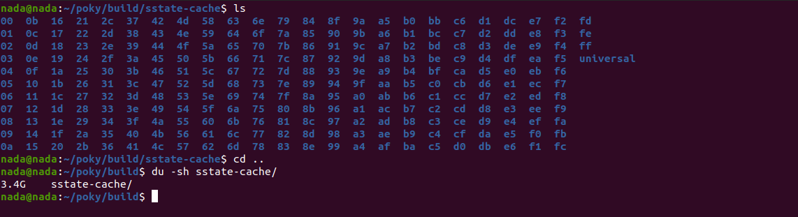
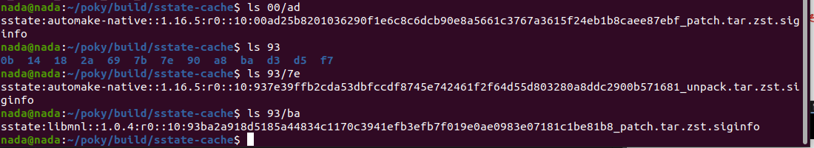

As mentioned previously, we have a LICENSE for our recipe, but now we have a question:  
Why choose MIT, and what is the difference between the MIT and GPL licenses?

With the GPL, if you modify the source code, you are required to republish it to keep it open source (copyrights).  
However, with the MIT license, you can modify open source code and keep your changes as closed source.

---

In the `local.conf` file, the machine naming is derived from: `/poky/meta/conf/machine`.

To add a machine in your recipe, you should follow this hierarchy to set the machine variable:
1. Create a layer on your host machine.
2. Create a machine directory under your layer.
3. Create a `local.conf` file that will contain the `MACHINE` variable.

Ensure layer compatibility. For example, I work with Kirkstone, so...

To create your layer, it could be an application layer (for package management or working with system calls) or a BSP layer (for working directly with the kernel).

In the `local.conf` file, some important variables include:

1. **sstate-cache**: Related to caches (stored tasks that have already run, like `do_fetch()`, `do_unpack()`). If you run BitBake again, it checks the cache to see if these tasks have finished; if they have, those tasks won’t be re-applied.  
Let's see it:

  

2. **tmp**: Includes
   1. The working directory for all recipes.
   2. The deploy directory, which contains the image (output) that I will `dd` to my SD card.

Instead of removing the image and creating a new one from scratch, you could simply remove the temp directory and create a new one with new configuration.

3. **DISTRO**: Represents the distribution name (e.g., Ubuntu, Almaza, MyDistro).  
You can edit it, but if you run BitBake afterward, it will fail unless you create a directory under your layer called `distro` (if you modify the `DISTRO` variable).

The hierarchy should be:  
`layer -> conf -> distro -> <your_distro_name>.conf`

If you open `local.conf` in the `poky` directory, you will find `DISTRO = "poky"`, which you can locate at `/meta-poky/conf/distro/poky.conf`.  
If you want to create your own distribution name, you might think about editing this file, but doing so could cause conflicts. Instead, create a `distro` folder under `/your_layer/conf/`.

In my case, it should be like: `yocto/meta-nada/conf/distro/almaza.conf`.  
In `almaza.conf`, you could `#include /meta-poky/conf/distro/poky.conf`. Then, you can copy `poky.conf` to `almaza.conf` and edit it.

## Now, what can we edit?  
First, we need to know that there are some specializations from one distro to another:
1. Package managers supported (e.g., `ipk` for Yocto, `rpm` for RedHat, `deb` for Debian).
2. Libraries (e.g., glibc, uClibc, musl).
3. Init processes (e.g., BusyBox, systemd, sysvinit).
4. Kernel version, loadable modules, etc.
5. U-Boot version.
6. Security settings, as Kali uses apps with higher security than Ubuntu.

Note: Kernel configurations happen under the BSP layer in `machine.conf`.

---

To recap:  
Metadata contains:
- `conf` directory, which includes:
  1. `layer.conf`
  2. `bblayers.conf`
  3. `meta-layer` -> `layer.conf`
  4. `machine.conf`
  5. `distro.conf`
- Recipe:
  1. `Bsp.bb`
  2. `package.bb` (application)
  3. `.bbappend`: If you have `recipe.bb` (written by someone else) and want to modify it, you can create `recipe.bbappend`. It should have the same recipe name and version.  
     For example, `google_1.2.bb` -> `google_1.2.bbappend` or `google_%.bbappend` (which would map to the latest version).

## Note: 
`inherit` should be used only with bbclasses.  
`bbclass`: It prepares the environment or functionality, so you don't need to do it yourself. For example, `inherit cmake` -> the bbclass will install CMake to be used in your recipe environment.
