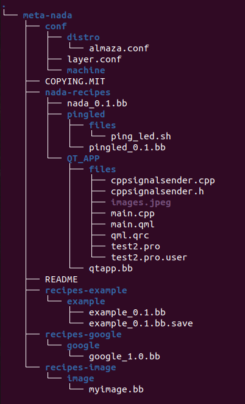
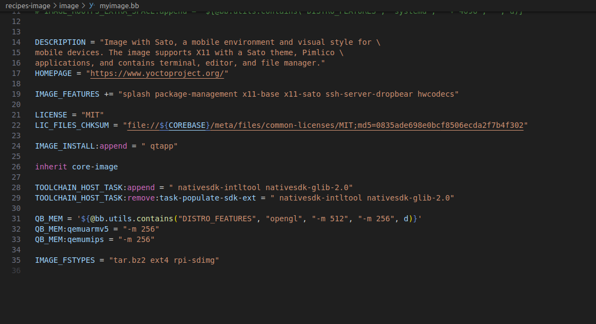
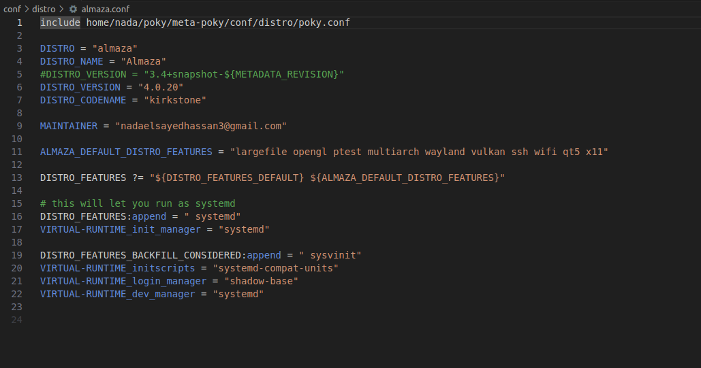

# Creating a Custom Yocto Image with `meta-nada` with QT application
This README provides a detailed overview of the structure and purpose of the files and recipes within this Yocto layer, including how to create a custom Yocto image with a Qt application.

## Overview

The `meta-nada` layer is designed to extend Yocto Project functionalities by integrating custom recipes, configurations, and images. This guide will walk you through the structure of the layer and the steps to build an image that includes a Qt-based application.

## Directory Structure

Here is the structure of the `meta-nada` layer:



## Components

### `conf` Directory

- **`distro/almaza.conf`**: Configuration for the Almaza distribution, specifying distribution features, version, and other settings.
- **`layer.conf`**: Layer configuration file, defining the layer’s compatibility with Yocto Project versions and specifying layer-specific settings.
- **`machine`**: Directory for machine-specific configurations (not used in the current setup).


### `COPYING.MIT`

The MIT license file for the layer.

### `nada-recipes/QT_APP`

- **`files/`**: Contains all the source files for the Qt application, including:
  - `cppsignalsender.cpp` and `cppsignalsender.h`: C++ files for signal handling.
  - `images.jpeg`: Image resources used in the application.
  - `main.cpp`: Main application logic.
  - `main.qml`: QML file defining the user interface.
  - `qml.qrc`: Qt resource file for including images and other resources.
  - `test2.pro` and `test2.pro.user`: Qt project files for building the application.
- **`qtapp.bb`**: Recipe for building and installing the Qt application.

### `recipes-image/image/myimage.bb`

Recipe for creating a custom image, including:
- **Summary and Description**: Details about the image and its features.
- **IMAGE_INSTALL**: Specifies additional packages to include, such as `qtapp`.
- **IMAGE_FEATURES**: Features enabled in the image, including X11 and SSH server.
- **LICENSE**: MIT license information.
- **TOOLCHAIN_HOST_TASK**: Specifies tools required for the SDK.
- **IMAGE_FSTYPES**: File types for the generated image (e.g., `tar.bz2`, `ext4`, `rpi-sdimg`).




### `conf/distro/almaza.conf`

Configuration for the Almaza distribution:
- **DISTRO**: Set to "almaza".
- **DISTRO_NAME**: "Almaza".
- **DISTRO_VERSION**: "4.0.20".
- **DISTRO_CODENAME**: "kirkstone".
- **DISTRO_FEATURES**: Includes features such as systemd, Qt5, and X11.
- **MAINTAINER**: Contact information for layer maintenance.




### `nada-recipes/QT_APP/qtapp.bb`

Recipe for building a QML-based Qt application:
- **SUMMARY**: Description of the Qt application.
- **DESCRIPTION**: Detailed information about the application, including source files and build instructions.
- **DEPENDS**: Specifies dependencies, such as `qtbase`, `qtdeclarative`, `qtquickcontrols2`, and `qttools`.
- **do_compile**: Compile the application using `oe_runmake`.
- **do_install**: Install the compiled application to the appropriate directory.


## Building the Image

To build the image that includes the `qtapp` application:

1. **Set up the Yocto environment**:
    ```bash
    cd /home/nada/poky
    source oe-init-build-env
    ```

2. **Build the image**:
    ```bash
    bitbake myimage
    ```

3. **Deploy and test**:
    Flash the resulting image from `tmp-glibc/deploy/images/raspberrypi3-64/` to an SD card and test on your Raspberry Pi.

