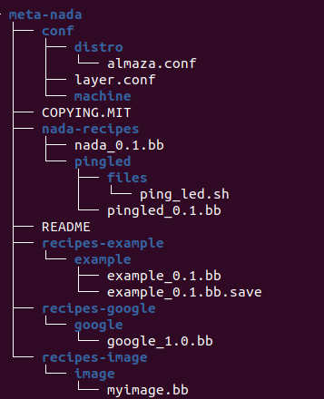
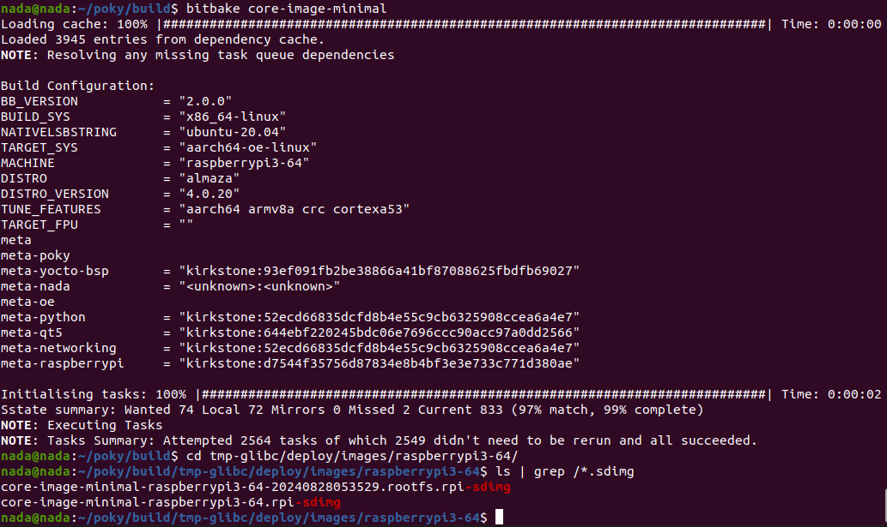

# Creating a Custom Yocto Image with `meta-nada`

Welcome to the journey of crafting a tailored Yocto image using your custom layer `meta-nada`. This guide will walk you through each step to build an image that includes your custom application and specific configurations. Let’s embark on this adventure to bring your embedded system to life!

## Introduction

In this guide, we'll cover the steps needed to create a Yocto image that integrates a custom application, `pingled`, which interacts with the host machine by pinging it and controlling an LED based on the ping results. We will also include the necessary configurations and layer setups to ensure everything runs smoothly.

## Prerequisites

Before we dive into the build process, make sure you have:
- Yocto Project environment set up.
- `meta-nada` layer added to your Yocto build.
- All necessary dependencies installed on your build machine.

## 1. Setting Up Your Yocto Build Environment

First, you need to prepare your Yocto build environment. Navigate to the directory where you have your Yocto project set up and source the environment setup script:

```bash
cd /home/nada/yocto
source poky/oe-init-build-env
```

This command sets up the build environment and prepares the necessary variables.

## 2. Configuring Your Build

### `bblayers.conf`

Your `bblayers.conf` file defines the layers Yocto will use in the build process. Open `conf/bblayers.conf` and ensure it includes the following lines:

```bash
BBLAYERS ?= " \
  /home/nada/poky/meta \
  /home/nada/poky/meta-poky \
  /home/nada/poky/meta-yocto-bsp \
  /home/nada/yocto/meta-nada \
  /home/nada/poky/meta-openembedded/meta-oe \
  /home/nada/poky/meta-openembedded/meta-python \
  /home/nada/poky/meta-openembedded/meta-networking \
  /home/nada/poky/meta-raspberrypi \
  /home/nada/yocto2/poky/meta-qt5 \
  "
```

This configuration ensures that all necessary layers, including your custom `meta-nada` layer and other dependencies, are included in the build process.

## `ping_led.sh` Script

Include the `ping_led.sh` script used by the `pingled` application:

```bash
#!/bin/sh

HOST="192.168.1.2"  # Replace with your host machine IP
GPIO_PIN=18  # Replace with the GPIO pin number connected to the LED

# Export GPIO pin and set direction to output
echo "$GPIO_PIN" > /sys/class/gpio/export
echo "out" > /sys/class/gpio/gpio$GPIO_PIN/direction

# Ping the host
ping -c 1 $HOST > /dev/null 2>&1

if [ $? -eq 0 ]; then
    # Ping successful, turn off LED
    echo "0" > /sys/class/gpio/gpio$GPIO_PIN/value
else
    # Ping failed, turn on LED
    echo "1" > /sys/class/gpio/gpio$GPIO_PIN/value
fi

# Unexport the GPIO pin
echo "$GPIO_PIN" > /sys/class/gpio/unexport
```

This script pings the specified host and controls an LED based on the ping results.


so now the hirerachy should be like that:





### `local.conf`

Your `local.conf` file contains configuration options for your Yocto build. Ensure it includes:

```bash
MACHINE ??= "raspberrypi3-64"
DISTRO ?= "almaza"
PACKAGE_CLASSES ?= "package_rpm"
EXTRA_IMAGE_FEATURES ?= "debug-tweaks"
IMAGE_INSTALL:append = " pingled python3 bash"
IMAGE_FSTYPES = "tar.bz2 ext4 rpi-sdimg"
INHERIT += "rm_work"
```

These settings specify the target machine, distribution, package management, image features, and installation options.

## 3. Creating Your Custom Recipes

### Recipe for `pingled`

Navigate to the `meta-nada/nada-recipes/pingled` directory and ensure the `pingled_0.1.bb` recipe is correctly defined:

```bash
SUMMARY = "Ping host machine and control LED"
DESCRIPTION = "This application pings the host machine and turns an LED on/off based on the ping result."
LICENSE = "MIT"
LIC_FILES_CHKSUM = "file://${COREBASE}/meta/files/common-licenses/MIT;md5=0835ade698e0bcf8506ecda2f7b4f302"

FILEPATH:append = " :${THISDIR}/files"
SRC_URI += "file://ping_led.sh"

do_install() {
    install -d ${D}${bindir}
    install -m 0755 ${WORKDIR}/ping_led.sh ${D}${bindir}/ping_led.sh
}
```

This recipe defines your application, including its dependencies, source files, and installation instructions.

### Recipe for the Image

Ensure your `myimage.bb` recipe in `meta-nada/recipes-image/image` is defined as follows:

```bash
SUMMARY = "My small image just capable of allowing a device to boot."
IMAGE_INSTALL:append = " pingled python3 bash"
LICENSE = "MIT"
LIC_FILES_CHKSUM = "file://${COREBASE}/meta/files/common-licenses/MIT;md5=0835ade698e0bcf8506ecda2f7b4f302"
inherit core-image
IMAGE_ROOTFS_SIZE ?= "8192"
IMAGE_ROOTFS_EXTRA_SPACE:append = "${@bb.utils.contains("DISTRO_FEATURES", "systemd", " + 4096", "", d)}"
```

This image recipe specifies the packages to include and other configurations.

## 4. Adding Configuration for Almaza Distribution

Include the following configuration for the Almaza distribution in your `meta-nada/conf/distro/almaza.conf` file:

```bash
include /home/nada/poky/meta-poky/conf/distro/poky.conf

DISTRO = "almaza"
DISTRO_NAME = "Almaza"
DISTRO_VERSION = "4.0.20"
DISTRO_CODENAME = "kirkstone"

MAINTAINER = "nadaelsayedhassan3@gmail.com"

# this will let you run as systemd
DISTRO_FEATURES:append = " systemd"
VIRTUAL-RUNTIME_init_manager = "systemd"

DISTRO_FEATURES_BACKFILL_CONSIDERED:append = " sysvinit"
VIRTUAL-RUNTIME_initscripts = "systemd-compat-units"
VIRTUAL-RUNTIME_login_manager = "shadow-base"
VIRTUAL-RUNTIME_dev_manager = "systemd"
```

This configuration sets up Almaza as the distribution, includes systemd support, and defines various runtime options.

## 5. Building the Image

With everything set up, it's time to build your custom image. Execute the following command in your Yocto build environment:

```bash
bitbake myimage
```

This command initiates the build process for your image, integrating all specified recipes and configurations.

## 6. Deploying the Image

After the build completes, you can find the generated image files in the `tmp-glibc/deploy/images/raspberrypi3-64/` directory. Flash the `rpi-sdimg` file to an SD card and insert it into your Raspberry Pi.



## 7. Verifying the Image

Power on your Raspberry Pi with the new SD card. Verify that your custom application `pingled` is functioning correctly by checking if it pings the host machine and controls the LED as expected.
 
so first you have to put your image on sdcard:

```sh
sudo dd if=/home/nada/poky/build/tmp-glibc/deploy/images/raspberrypi3-64/core-image-minimal-raspberrypi3-64-20240828053529.rootfs.rpi-sdimg of=/dev/mmcblk0 bs=1M
```

then run:
```sh
sudo picocom -b 115200 /dev/ttyUSB0
root
cd /
ping_led.sh
```
