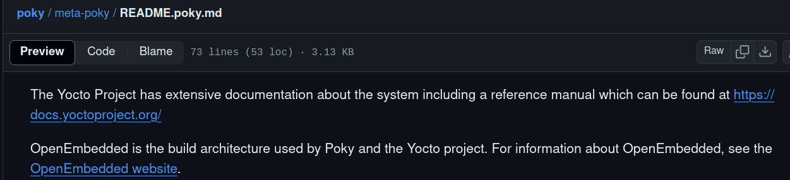

First, we'll cover some information about the BitBake tool, which requires some configurations called metadata to create our image. To do this:

1. We will create a directory called `Image_Generator_Dir` and then navigate to it using `cd Image_Generator_Dir`.
2. Next, we need to go to the `OpenEmbedded` community on GitHub, which contains the BitBake repository. We'll clone it using `git clone bitbake`. BitBake is written in Python, making it abstract from any architecture. This abstraction makes implementation easier, as you'll only need Python on your target. Now we have the BitBake folder.
3. To create an image, you still need metadata. OpenEmbedded has decided to create many layers containing applications. For example, if you want to download Python, you'll need to download `meta-core` (where "meta" refers to a layer), which contains many applications, including Python. So, use `git clone meta-core` to clone this layer.

In general, layers are split into two categories:
- **Apps**: For example, the Python application mentioned earlier belongs to the userspace and falls under this layer.
- **BSP (Board Support Package)**: If you want to download something for hardware, like for an RPI (Raspberry Pi), there is a layer for that. This includes components like U-Boot, the kernel, etc., which build on the board itself. You can use `git clone meta-raspberrypi` to clone this BSP layer.

- In the OpenEmbedded community, there are two types of layers (Apps and BSP), but sometimes they are not clearly separated and can be found in one layer.

Now, we have three folders in `Image_Generator_Dir`.

You might not know how to map BitBake to these folders, which is one of the problems with OpenEmbedded. You don't know what BitBake or the layers do; you just clone them. The first problem was:

### 1st Problem for OpenEmbedded -> Documentation:

You have everything you need to create an image, but you might not know how to use it. This is where Yocto comes in. In 2011, Yocto provided documentation on how to use BitBake with layers and explained that it uses OpenEmbedded. Yocto is more famous for its documentation, but there is still confusion about whether Yocto creates a distribution. As you can see from the documentation:



Yocto does not create a distribution; it is a reference (it just shows how to create an image). The actual image creation is done by OpenEmbedded using BitBake.

Yocto provides two layers (`meta-poky`, `meta-yocto-BSP`) in the `poky` repository:
- **meta-poky**: This is for Apps, different from meta-core.
- **meta-yocto-BSP**: This is for hardware, supporting a number of boards, including BeagleBone.

Additionally, other important layers from OpenEmbedded include (`meta-core`, `meta`, `meta-skeleton`, `meta-selftest`).
- **meta-skeleton**: Acts as a template or structure for creating BSPs.

### 2nd Problem for OpenEmbedded -> Compatibility:

There may be compatibility issues between versions. For example, if you download BitBake version 4 and need Python, you might download `meta-core` version 10, but the last work on this layer was done with BitBake version 1. If you configure BitBake with this layer, it will fail due to compatibility issues.

Yocto solves this by making Poky your destination. When you download it, it contains BitBake along with some branches (releases) like `zeus`, `dunfell`, `kirkstone`, and `master`. For example, `zeus` is one of the older releases from 2016. If you clone it and want a specific layer with Apps, you first clone the layer and check if the BitBake branch you have (e.g., `zeus`) is compatible with it, allowing you to create your image.

- The `dunfell` release was in 2018.
- The `kirkstone` release was in 2020.
- The `scarthgap` release is the newest one, but it might not yet have compatible layers.

### Note:

**Long-term support concept**: This means that each branch has compatible layers for a period until the next release.

So, again, Poky is a reference distribution that supports compatibility and documentation to facilitate communication with OpenEmbedded, which includes BitBake and meta layers.

The meta layer (metadata) contains:
- .conf files
- .bb files
- .bbappend files
- .class files

Types of variables for Yocto or BitBake specifically: who reads these variables?

**Local:** Anything with the following extensions:
- .bb
- .bbappend
- .class

**Global:** Anything with the following extension:
- .conf

**How to assign a variable:**
```sh
myvar="string"  # Always a string, so it should be in quotes
```

**How to read a global variable with the BitBake tool:**

```sh
bitbake-getvar  # Works with global variables
```

Let's try to set a global variable in `local.conf`:

```sh
cd yocto/poky/jetsonnano/conf
vim local.conf
```

To set the variable:
```sh
myvar="5"
```

```sh
bitbake-getvar myvar
```

### Global Variable Assignment (across all metadata, all .conf files)

1. **Weak Assignment (`?=`):**
   ```sh
   myvar="3"
   myvar ?= "6"
   ```

   When using `bitbake-getvar myvar`, you'll notice it prefers the normal assignment over the weak assignment. If you set the same variable name with a normal assignment at any time, it will be taken directly.

   Example:
   ```sh
   myvar ?= "3"
   myvar ?= "6"
   ```
   It will take the first one.

   Example:
   ```sh
   myvar = "3"
   myvar = "6"
   ```
   It will take the last one.

2. **Weak Weak Assignment (`??=`):**
   It will not be assigned until the end of the code. If this is the only assignment for this variable in all .conf files, it will be assigned with this assignment type, acting as a default value. Otherwise, it will not be accepted.

   Example:
   ```sh
   myvar ??= "3"
   myvar ?= "4"
   ```
   It will take "4" here.

   Example:
   ```sh
   myvar ??= "3"
   myvar ??= "6"
   ```
   It will take the last one, as is normal when it's not assigned.

3. **Append:**
   ```sh
   myvar += "5"  # This method adds a space
   ```
   If `myvar` initially contains "4", it will now be "4 5".

   Another way to append without a space is alphabetical append, which has lower priority:
   ```sh
   myvar:append = "5"
   ```
   Now, `myvar` is "45".

   Example:
   ```sh
   myvar = "3"
   myvar += "5"
   myvar:append = "6"
   ```
   `myvar` would be "3 56".

   Example:
   ```sh
   myvar = "3"
   myvar:append = "5"
   myvar += "6"
   ```
   `myvar` would be "36 5".

   Example:
   ```sh
   myvar ??= "3"
   myvar:append = "5"
   myvar += "6"
   ```
   `myvar` would be "6 5".

   Example:
   ```sh
   myvar ?= "3"
   myvar:append = "5"
   myvar += "6"
   ```
   `myvar` would be "36 5".

   Example:
   ```sh
   myvar ?= "5"
   myvar += "6"
   myvar = "7"
   ```
   `myvar` would be "7".

   Example:
   ```sh
   myvar ?= "5"
   myvar += "6"
   myvar ?= "7"
   ```
   `myvar` would be "5 6".

4. **Prepend (`=+`, `:prepend`):**
   You can write it in two ways, like append, and it has the same behavior as append:
   ```sh
   myvar =+ "7"
   myvar:prepend = "7"
   ```

5. **Immediate Assignment (`:=`):**
   ```sh
   xar = "3"
   myvar = "${xar}"
   xar = "4"
   ```
   Now, `myvar` would be "4".

   Example:
   ```sh
   xar = "3"
   myvar := "${xar}"
   xar = "4"
   ```
   Now, `myvar` would be "3".

   Example:
   ```sh
   myvar = "${xar}"
   xar = "4"
   ```
   Or:
   ```sh
   myvar := "${xar}"
   xar = "4"
   ```
   Now, `myvar` would be "4".

   Example:
   ```sh
   myvar := "${xar}"
   xar = "4"
   xar = "5"
   ```
   Now, `myvar` would be "5".

6. **Append & Prepend with Dots (`.=`, `=.`) Respectively:**
   `.= for append`, `=. for prepend` (doesn't include space)

   (`+=`, `=+`), (`.=`, `=.`) have the same priority level. If they come together, priority will be detected sequentially (which comes first). `(:append, :prepend)` has the last priority.

7. **Remove:**
   Example:
   ```sh
   myvar= "3 5 6"
   myvar:remove = "5"
   myvar= "3 6"
   ```

   Example (Immediate Assignment):
   ```sh
   xar ??= 3
   myvar = "${xar}"
   xar ??= 4
   ```
   Now, `myvar` would be "4".

   Example:
   ```sh
   xar ??= 3
   myvar := "${xar}"
   xar ??= 4
   ```
   Now, `myvar` would be "3".

   Example:
   ```sh
   xar ??= 3
   myvar := "${xar}"
   xar = 4
   myvar:append = "${xar}"
   ```
   Now, `myvar` would be "34".

   Example:
   ```sh
   myvar := "${xar}"
   xar = "5"
   xar:prepend = "7"
   myvar:append = "${xar}"
   ```
   Now, `myvar` would be "75".

   Example:
   ```sh
   myvar := "${xar}"
   xar = "5"
   xar:prepend = "7"
   xar =+ "9"
   xar =. "8"
   myvar:append = "${xar}"
   ```
   Now, `myvar` would be "789 5".

It's important to know that when working with Yocto, you will constantly work with variables.

**Note:**
If you set a variable in a `.conf` file, it will be visible in a `.bb` file, even if it's a local area. This makes sense since `.conf` files contain global variables visible to all metadata.

However, if you set a variable in a `.bb` file, it won't be visible in any other location outside of the `.bb` file.

**Local Variables:**
- `S` -> directory
- `B` -> directory
- `D` -> directory

These are variables that hold directories (recipe).

so to understand local variables we need to create a recipe you can find it here
as local variable applies on recipes
so to see them we need to create `.bb` file which is the recipe itself
