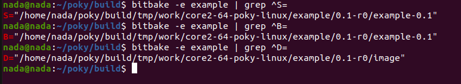
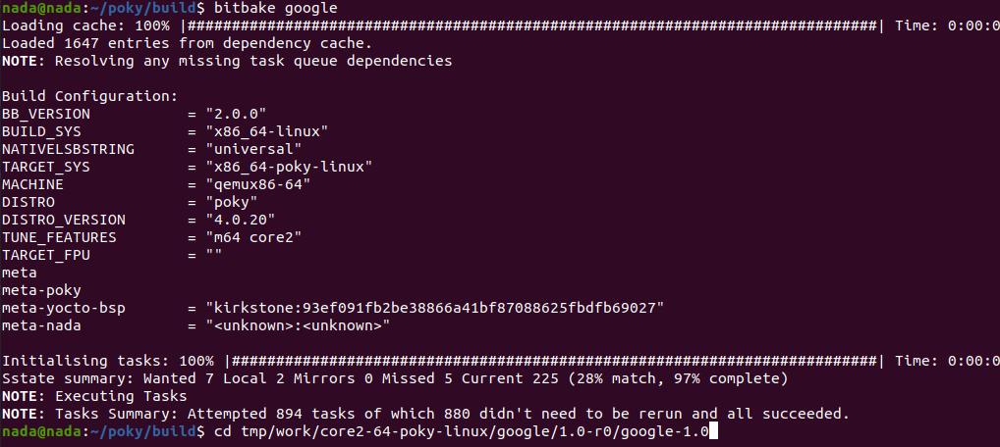

So, we've already discussed variable assignment and types, and we've used some BitBake commands like `bitbake-layer create-layer` and `bitbake add-layer`.

Now, we need to talk more about recipes. As we mentioned previously (when we talk about recipes, we refer to files with the `.bb` extension), let's dive into the content of a recipe and how to write it.

## 1. Recipe Headers:

- **Documentation**: Considered a local variable.
- **Description**: Considered a local variable.

## 2. LICENSE:

When you create a recipe, you should specify which license the recipe is based on. 

For example, if your license is based on MIT, you would set `LICENSE = "MIT"`.  
You should also set `LIC_FILES_CHKSUM`.


If you want to skip setting a LICENSE, you should set it to `LICENSE = "closed"`.

You can find all necessary licenses in `poky/meta/files/common_licenses/`.


So, what is a license? It's a text file that includes the permissions you have.

### How to Calculate the Checksum:

`md5sum` is a command used to calculate the checksum of a file by passing the license file to it:

```sh
md5sum MIT
```


Take this value and assign it to `LIC_FILES_CHKSUM = <schema>//[location of MIT file];md5=<hash here>`, where the hash is the output of `md5sum MIT`.

Example:


So, what is `<schema>`? It indicates the location of your license. There are three types:

1) **File locally (on machine)**: `file://`
2) **File on GitHub** (clone through SSH or HTTPS): `git://`
3) **File on HTTP server** (using `wget`): `http://`

Since BitBake only accepts absolute paths, you can use variables to help:

```sh
cd ~/poky/build
bitbake-getvar COREBASE  # Refers to `/home/nada/poky`
md5sum ../meta/files/common-licenses/MIT  # To get the checksum
```


### Applying the License:

so we will edit on our previous recipe or you can do a new one

```sh
cd /home/nada/yocto/meta-nada/nada-recipes
nano nadaRecipe_0.1.bb
```

Write the following in the recipe file:

```sh
SUMMARY = "This is my recipe"
DESCRIPTION = "This recipe does nothing"

LICENSE = "MIT"
LIC_FILES_CHKSUM = "file://${COREBASE}/meta/files/common-license/MIT;md5=<hash_you_create_using_md5sum>"
```


If you don't write this, the license won't work, so you must create the checksum to follow your file.

If you don't want to do all that, you can set:

```sh
LICENSE = "CLOSED"
```

## Development section
## 3. SRC_URI:

This local variable is responsible for cloning files to the `dl` directory (downloads) as mentioned earlier in "Creating Layer," and it uses `<schema>` related to file location.

```sh
SRC_URI = "git://<repo_link>;protocol=<e.g., https>;branch=<e.g., main>"
```

**Note**: Poky doesn't support SSH but does support HTTPS.  
BitBake will unpack this file into the `S` directory.

If you want to clone a file locally, you can write the `SRC_URI` by passing the file name only, like this:

```sh
SRC_URI = "file://<file_name>"
```

But be aware that this file should be in a specific place, which we'll explain later.


## 4. SRCREV:

This is used only with Git and is used to checkout a specific commit hash.  
As each commit is created, a hash is generated for it as well.

tasks flow for recipe:
1. do_fetch() task calls SRC_URI to fetch from (ex. github) to dl directory
2. do_unpack() task happened at working directory (WORKDIR) 
3. do_patch()
4. do_configure() here you use bash commands (bash shell) or any commands under /usr/bin dir
or by using `python do_configure` you can write python commnds inside it (python shell)
5. do_compile()
6. finally do_install()

if you don't implement them bitbake apply a defualt implementation for them

**Note**:  
There are other local variables hidden in each recipe, like:

- **PV**: Package version
- **PR**: Package release
- **PN**: Package name
- **S**: Source directory of the recipe (unpacked)
- **B**: Build directory (for compilation)
- **D**: Destination directory used by the package feeder

You can edit these to change the directory to another location.

- **WORKDIR**: The top directory for the recipe, which includes (S, B, D).

### How to Name a Recipe:

```sh
<package_name>_<package_version>_<package_release>.bb
e.g., myrecipe_0.1_r3.bb
```

### How to Read the Value of a Local Variable:

Using:

```sh
bitbake -e <recipe> | grep <variable_you_want>
```

The `-e` option tends to extend.




When BitBake takes your recipe as input, it creates Python commands by adding the hidden variables.  
To see that, you can write:

```sh
bitbake -e nadaRecipe > pythonout
less pythonout
```

This redirects all Python commands from the recipe to `pythonout` (piping). As you can see here:


You can search for the PV variable (package version):


In this example, my recipe is v1.0:


### Now Let's Apply Our Task:

We will clone a demo app from a Git repository to our Yocto recipe.

First, let's create a new recipe directory:

```sh
mkdir recipes-google/google
touch google_1.0.bb
code .
```

**Note**: Install the "Yocto Project BitBake" extension in VS Code for better code display.


If we build our image now, it will give you a "Please set a valid SRCREV for URL" error:


So, we should specify the commit we want (we'll pick the latest commit):


Now let's build again:


Let's now expand the file:


Let's open the `S` directory:


It's empty because no compilation has happened, or we don't have an executable yet.  
So, how can we compile it? As you can see here, this app uses `cmake` to compile:


Now, I have to write some tasks which BitBake has already defined with default definitions (as weak functions or assignments), like `do_compile` and `do_install`.

As you can see, it hasn't been implemented:


so let's now
**Updating the Source Directory**

First, update the source directory where the application will be unpacked using the `WORKDIR` variable and place it under the `git` directory:

*(The `S` variable points to the source directory where the code will be fetched)*


Next, set the following:

- **DEPENDS**: Indicates that the recipe depends on CMake, so it will be available during the build as we said before that yocto create its own environment it doesn't use any thing from my host machine

- **inherit cmake**: Inherits the CMake class, which provides common CMake build functionality. This is necessary because it automates the configuration and build process using CMake, saving you from manually setting up these steps.

**Adding `do_compile` and `do_install` Functions**

**`do_compile()`**:

- In Yocto, oe_runmake is a helper function used in recipes to invoke make commands during the build process. It ensures that make is called in a consistent environment
- so here make or cmake only would run correct

**`do_install()`**:

- Creates the binary directory (`${bindir}`) in the destination directory (`${D}`).

- Installs the compiled executable from the build directory (`${B}`) to the binary directory.

**Recipe Example:**

```sh
## HEADER SECTION
SUMMARY = "Demo App Recipe"
DESCRIPTION = "This recipe clones and builds the demo app"

LICENSE = "MIT"
LIC_FILES_CHKSUM = "file://${COMMON_LICENSE_DIR}/MIT;md5=0835ade698e0bcf8506ecda2f7b4f302"

SRC_URI = "git://github.com/FadyKhalil/DemoApp.git;protocol=https;branch=main"

SRCREV = "720c663c5fd7246b4b42c5205d74db7d9784b5b2"

# Where the source files will be located after fetching

S = "${WORKDIR}/git"
DEPENDS = "cmake"

inherit cmake

S = "${WORKDIR}/git"
B = "${WORKDIR}/build"
D = "${WORKDIR}/image"

do_configure(){
  #This ensures that CMake is properly configured to produce the desired output, with static linking as specified.
  #-DCMAKE_EXE_LINKER_FLAGS="-static": Sets the linker flags for executables to be statically linked.
  #-DCMAKE_SHARED_LINKER_FLAGS="-static": Sets the linker flags for shared libraries to be statically linked.
  cmake -S ${S} -B ${B} -DCMAKE_EXE_LINKER_FLAGS="-static" -DCMAKE_SHARED_LINKER_FLAGS="-static"
}

do_compile() {
    #In Yocto, oe_runmake is a helper function used in recipes to invoke make commands during the build process. It ensures that make is called in a consistent environment
    #so here make or cmake only would run correct
    oe_runmake -C ${B}
}

do_install() {
    # Create the destination directory for binaries
    # bindir -> /usr/bin
    install -d ${D}${bindir}  

    # Install the compiled binary
    install -m 0755 ${B}/calculator ${D}${bindir}/  
}
```


**Building and Installing**




Now you need to understand an important file called `documentation.conf`:
```sh
cd ~/poky/meta/conf/documentation.conf
```


This file contains a simple description of all tasks and variables. However, I couldn't find the binary files here.

For reference: to run a specific task, such as `do_cleanall()`, you should write:
```sh
# In the build directory of Poky
# Add the task name only without "do"
bitbake -c cleanall <recipe_name>
```

Another file you should be aware of is `bitbake.conf` in the same directory.

This file defines the "standard target filesystem paths," which indicates where all files will be downloaded to in the root filesystem generally.


To edit global variables, you can find them in `local.conf`, `distro.conf`, and `layer.conf`. Note: Do not edit any local variables directly, as changes will affect all recipes. If you need to make adjustments, consider appending changes instead.