# Communication Setup Between Host Machine (x86) and VExpress via Ethernet

## Introduction
Welcome to the Embedded Linux series! This task involves creating and managing users and groups using Bash scripts. Below, I provide detailed instructions for each step, including checking for existing users and groups.

## Prerequisites
To establish communication between your host machine (x86) and VExpress, you need to have U-Boot or a minimal Linux kernel installed on the VExpress. The communication will be done via the Ethernet protocol, enabling you to ping from the x86 host. Follow the steps below to achieve this setup.

## Step 1: Flashing Through Physical Memory Using fatload for 2 Addresses

1. **Load Kernel and Device Tree**:
   - Use the `fatload` command to load the kernel image and the device tree blob (DTB) into memory.
     ```sh
     fatload mmc 0:1 $kernel_addr_r zImage
     fatload mmc 0:1 $fdt_addr_r file.dtb
     ```

2. **Create U-Boot Setup Script**:
   - Write your setup commands in a text file (e.g., `qemu_ifup`).
    ```sh
    #!/bin/sh
    ip a add <YourIPAddress> dev $1
    ip link set $1 up
    ```
    then give the script the execute permission, run the follow command
    ```sh
    chmod +x qemu_ifup
    ```
    **Make sure that the script in the same directory of the u-boot
    and now you can test the connection between server and your host machine using `tap` at qemu running command:
    ```sh
    sudo qemu-system-arm -M vexpress-a9 -m 128M -nographic -kernel path/u-boot -sd path/sd.img -net tap,script=./qemu_ifup -net nic
    ```
   - Convert this text file to a U-Boot script image using `mkimage` to make it executable.
     ```sh
     mkimage -T script -C none -n 'QEMU Setup Script' -d qemu_ifup qemu_ifup.img
     ```


3. **Generic Addressing**:
   - Ensure your script uses environment variables (`$kernel_addr_r` and `$fdt_addr_r`) instead of fixed addresses to maintain flexibility.

  **What about generate our qutoboot script now:**
  ```sh
    # Check for MMC device and load zImage and hardware.dtb from SD card
  if test ${dev} = mmc; then
      echo "Checking for MMC..."
      if mmc dev 0; then
          echo "MMC found. Loading zImage and hardware.dtb..."
          if load mmc 0:1 ${Kernel_AddressInDRAM} zImage; then
              echo "zImage loaded successfully."
          else
              echo "Failed to load zImage."
              exit 1
          fi
          if load mmc 0:1 ${ftd_FileAddress} hardware.dtb; then
              echo "hardware.dtb loaded successfully."
          else
              echo "Failed to load hardware.dtb."
              exit 1
          fi
          bootz ${Kernel_AddressInDRAM} - ${ftd_FileAddress}
          exit 0
      else
          echo "MMC device not found."
      fi
  fi

      # Check for network communication
  if test ${dev} = nic; then
      echo "Checking for network..."
      #just doing that here untill installing tftp
      # If no option is available
  echo "No suitable boot option found."
  ```

## Step 2: Flashing Through Server Using TFTP
(Using a protocol supported by U-Boot like TFTP, as x86 has protocols like HTTP which do not work with U-Boot, so you need to install the TFTP application.)

1. **Install TFTP Server**:
   - Install the TFTP server application on your x86 host.
     ```sh
     sudo apt install tftpd-hpa
     ```
   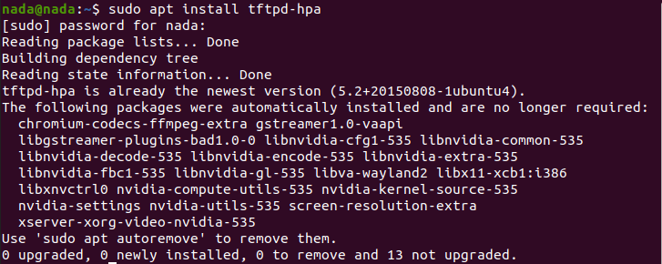

2. **User and Directory Configuration**:
   - What happens when I install it? First, a user named `tftp` will be created, and you can find it in `/etc/passwd`. Let's check:
     ```sh
     cat /etc/passwd | grep tftp
     ```
   

   The UID is in the range of 1:199, and it also has a TFTP daemon, which means it is running in the background on my OS. It operates under `/srv/tftp`, similar to how a normal user works in the `/home` directory.

   - Confirm that `tftp` is a system user (UID = 128) and operates under `/srv/tftp`.

3. **TFTP Configuration**:
   - Edit the TFTP server configuration file `/etc/default/tftpd-hpa`:
  
   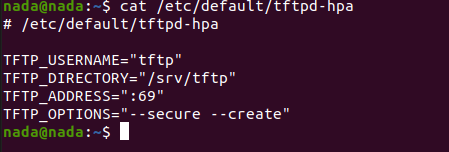

   It specifies the directory, address (port 69), and options. Since `tftpd-hpa` is the directory I will work with, I need to have read and write permissions on it. As we see, it currently has only `--secure`, which means read-only permission, so I should add the `--create` option (write permission is a must).

   - Ensure the `--create` option is added to allow write permissions.
   - Restart the service to ensure that your changes are saved:
     ```sh
     systemctl restart tftpd-hpa.service
     ```

4. **Service Management**:
   - The TFTP service is managed by an executable in `/etc/init.d/` with start and stop functions.
   
   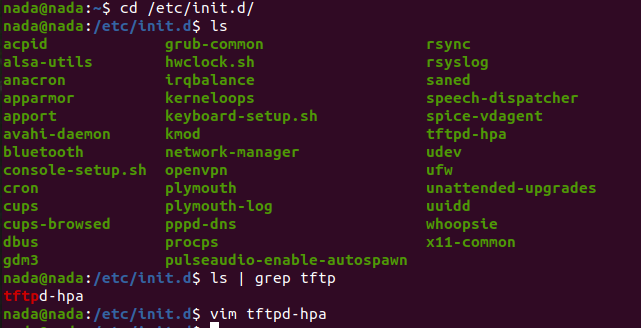

   Additionally, under the `/etc/init.d/` directory, there is a `tftpd-hpa` executable file with start and stop functions. When `init.d` runs this app, it passes the configuration to it so you can use it.
   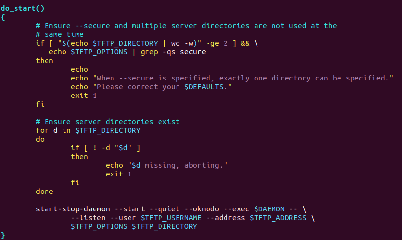
   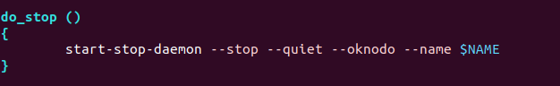

   - Check the service status to ensure it is running:
     ```sh
     systemctl status tftpd-hpa.service
     ```
   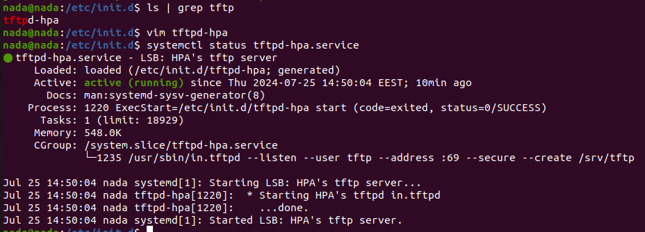

   You can also start and stop the service using these commands:
   ```sh
   # To start
   systemctl start tftpd-hpa.service
   
   # To stop
   systemctl stop tftpd-hpa.service
   ```
   

   It will be running in the background by default.  
   - A service in this context means a background process that performs specific functions, such as handling TFTP requests.

   You can check the installation through:
   ```sh
   dpkg -L tftpd-hpa
   ```

5. **Verify Installation**:
   - List installed files and directories for `tftpd-hpa`:
     ```sh
     dpkg -L tftpd-hpa
     ```
   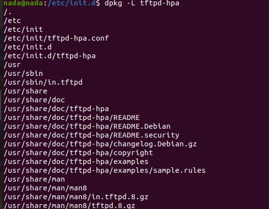

   When you install the TFTP package (compressed package), everything will go to its right place, as seen under `/usr/sbin`. The `tftpd-hpa` app will download to it with some documentation.

6. **Where Does the Configuration Actually Take Place?**:
   - Under `/etc/init/tftpd-hpa.conf`
     Ok, but why not under `/etc/default`?
     It's actually included in `tftpd-hpa.conf` here:
     ```sh
     env DEFAULTS="/etc/default/tftpd-hpa"
     ```
   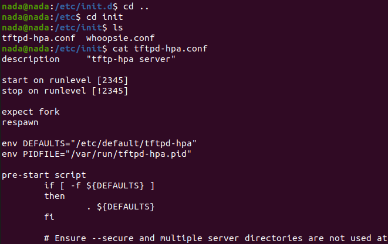

7. **How Does Communication Between My Host Machine and U-Boot Work?**:
   - When U-Boot starts sending TFTP requests to x86 (which is the kernel), the kernel retrieves the TFTP request and specifically focuses on `/srv/tftp` to place the needed file to be loaded under the TFTP folder.
   - Note that the owner of this is `/root` and its group is `nogroup`, which you can see using `ls -l tftp`. Since the system user `tftp` will access this folder, you need to change the owner for this folder and the group (not mandatory).
     ```sh
     # Change user:group for the folder
     chown tftp:tftp tftp
     ```

   - Now, it seems all good and you can use the `tftp` command by passing the address and the file needed to load in U-Boot.
   - However, it may fail. Why? Because you need to set the `serverip` first with the host x86 address. 
   - Now, let's try:
     ```sh
     sudo qemu-system-arm -M vexpress-a9 -m 128M -nographic -kernel u-boot -sd /home/nada/sd.img -net tap,script=./qemu_ifup -net nic
     setenv ipaddr 192.168.1.x #(set your IP based on your netmask)
     setenv serverip 192.168.1.x #(the address of the host machine)
     saveenv
     # Here you can load the image (so let's boot with these two addresses)
     tftp $kernel_addr_r <your_zimage>
     tftp $fdt_addr_r <your_file.dtb>
     
     # Let's see the content of these two addresses
     md $kernel_addr_r
     md $fdt_addr_r

     # Now, when I run this, I will get a kernel panic as it didn't find rootfs
     # We will fix this later
     bootz $kernel_addr_r - $fdt_addr_r
     ```
   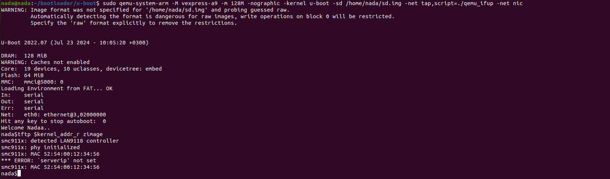
   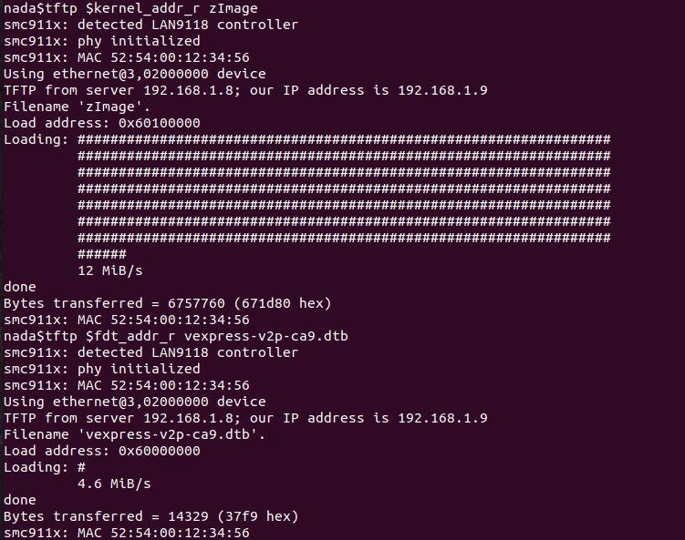
   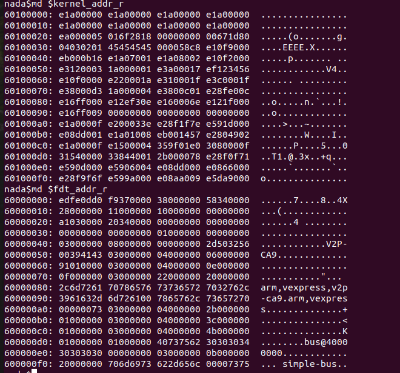

### bootz command and image types:
  - The bootz command in U-Boot is used to boot a zImage kernel, which is a compressed kernel image format used by ARM Linux kernels. Here's a brief 
    overview of the different image types and their relation to bootz:

    - zImage:
        A compressed kernel image.
        Loaded into memory and decompressed by the kernel itself.
        bootz is specifically used to boot zImage files.

    - uImage:
        A wrapper around a kernel image (can be zImage or uncompressed).
        Created using the mkimage tool.
        Contains metadata like load address and entry point.
        Booted using the bootm command.

    - Image:
        An uncompressed kernel image.
        Typically used in modern ARM kernels.
        Booted using the booti command.

**Let' now generate the complete autoboot script**
```sh
# Check for MMC device and load zImage and hardware.dtb from SD card
if test ${dev} = mmc; then
    echo "Checking for MMC..."
    if mmc dev 0; then
        echo "MMC found. Loading zImage and hardware.dtb..."
        if load mmc 0:1 ${Kernel_AddressInDRAM} zImage; then
            echo "zImage loaded successfully."
        else
            echo "Failed to load zImage."
            exit 1
        fi
        if load mmc 0:1 ${ftd_FileAddress} hardware.dtb; then
            echo "hardware.dtb loaded successfully."
        else
            echo "Failed to load hardware.dtb."
            exit 1
        fi
        bootz ${Kernel_AddressInDRAM} - ${ftd_FileAddress}
        exit 0
    else
        echo "MMC device not found."
    fi
fi

# Check for network communication
if test ${dev} = nic; then
    echo "Checking for network..."
    setenv serverip 192.168.1.8
    if ping -c 1 192.168.1.8; then
        echo "Network available. Loading files from TFTP server..."
        if tftp ${Kernel_AddressInDRAM} zImage; then
            echo "zImage loaded successfully from TFTP."
        else
            echo "Failed to load zImage from TFTP."
            exit 1
        fi
        if tftp ${ftd_FileAddress} hardware.dtb; then
            echo "hardware.dtb loaded successfully from TFTP."
        else
            echo "Failed to load hardware.dtb from TFTP."
            exit 1
        fi
        bootz ${Kernel_AddressInDRAM} - ${ftd_FileAddress}
        exit 0
    else
        echo "No network available."
    fi
fi

# If no option is available
echo "No suitable boot option found."
```
then let's follow:
```sh

#use the mkimage tool to convert setup.txt into a U-Boot script image. If mkimage is not installed, you may need to install it (typically part of the u-boot-tools package).

mkimage -A arm -T script -C none -n 'Setup Script' -d setup.txt setup.scr

#run qemu
sudo qemu-system-arm -M vexpress-a9 -m 128M -nographic -kernel path/u-boot -sd path/sd.img -net tap,script=./qemu-ifup -net nic

bdinfo

#then i have to set ipaddr, serverip
#in my case
setenv ipadd 192.168.1.9

#the address of the host machine that you set at qemu_if script
setenv serverip 192.168.1.8

saveenv

fatload mmc 0:1 0x60003000 /setup.txt
source 0x60003000

setenv bootcmd 'fatload mmc 0:1 ${loadaddr} setup.scr; source ${loadaddr}'
saveenv

reset
```