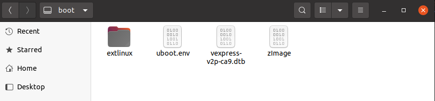
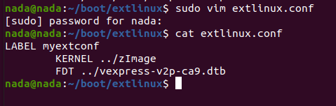
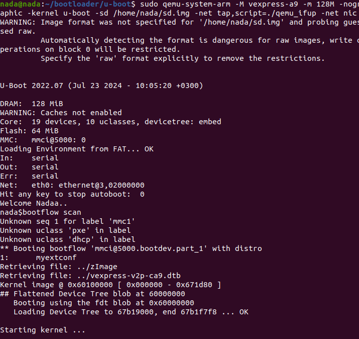
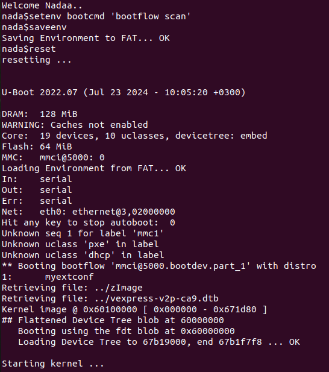

## Alternative Method: Using bootflow scan

- U-Boot offers an alternative method for handling scripts and configuring autoboot using the *bootflow scan* command.
- What does `bootflow scan` do? It first searches the EFI system partition, such as our FAT16 partition, but it is not exclusive to FAT16. Let's explore this concept further.

### EFI Partition

- The EFI partition should be a bootable, primary partition.
- When working with an RPI SD card and installing its package, you'll find the `/boot` directory under the root filesystem (ext4). You can verify this by creating a hard link between them.
- When the SD card is created, it typically has only one partition, which is of type ext4, primary, and bootable. This means the EFI partition can be ext4. However, a drawback is that storage space is shared between `/boot` and the root filesystem (`rootfs`). If the partition crashes, the entire system will fail.

### bootflow scan

- As the command name suggests, `bootflow scan` searches for the `extlinux.conf` file.
- Instead of writing a script and saving it to `bootcmd`, you can directly write to this file. Then, simply run `bootcmd=bootflow scan`, which will locate the `extlinux` folder and then the `extlinux.conf` file under the boot partition.
- Here's how to write to this file:

    1. **Create or edit the `extlinux.conf` file**:
        - Navigate to the `extlinux` folder under the boot partition. If it does not exist, create it.
        - Create or edit the `extlinux.conf` file in this directory.
        


    3. **Add your configuration**:
        - Write your configuration with a LABEL, KERNEL, and FDT, as shown below:

            ```sh
            LABEL <anyname>
                KERNEL ../<your_zImage>
                FDT ../<your_file.dtb>
            ```
   

    4. **Apply the configuration**:
        - Save the `extlinux.conf` file.
        - Run the command `bootflow scan` in U-Boot. This will instruct U-Boot to search for and apply the configuration from the `extlinux.conf` file.
       
       

        - you can save it at bootcmd for autoboot using:
        ```sh
        setenv bootcmd 'bootflow scan'
        saveenv
        ```
        
