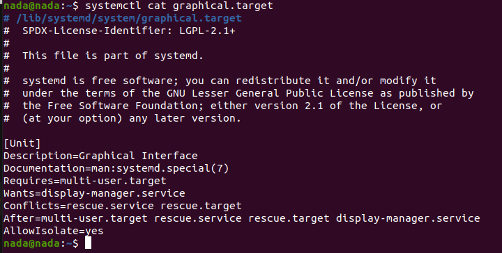
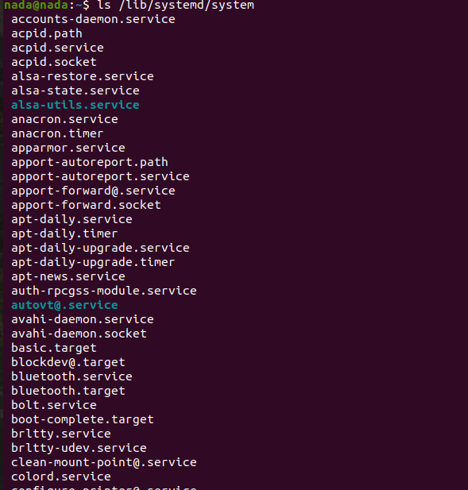
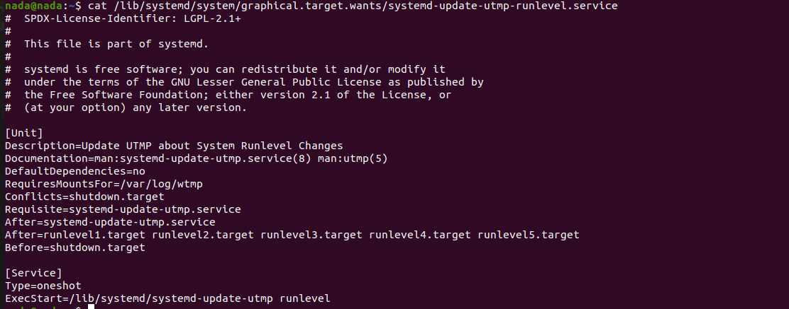
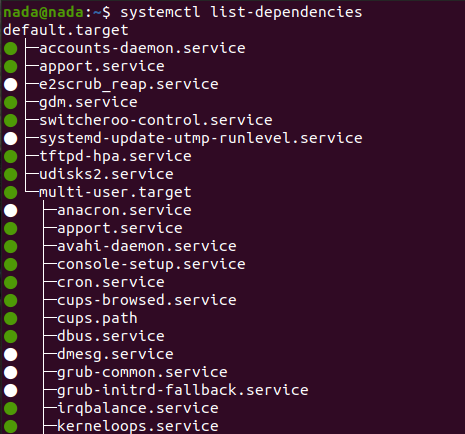
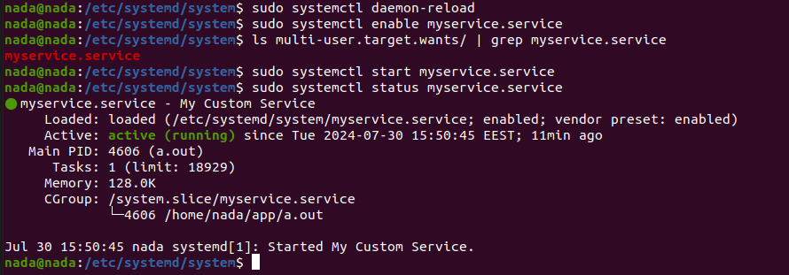
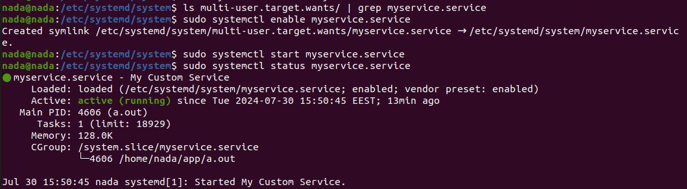
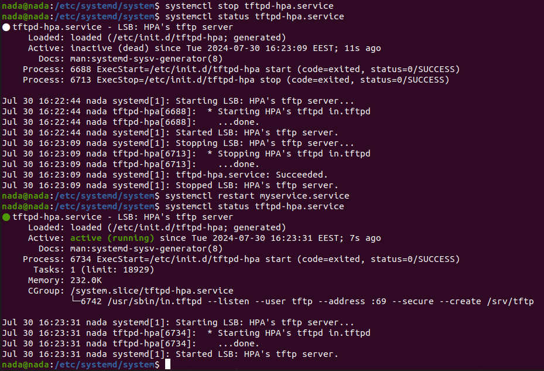

**systemD**

**Types of Processes:**

- **Foreground Process:** A process that runs and with which the user can interact.
- **Background Process:** A process that runs without user interaction but can be brought to the foreground at any time.
- **Orphan Process:** If process (2) is killed, process (1) will adopt process (3).  
  For example:
  ```
  ------------
  |     1    |    (this is the init process)
  ------------
       |
  ------------
  |     2    |    (this is the parent process)
  ------------
       |
  ------------
  |     3    |    (this is the child process)
  ------------
  ```
  Note: If you create a file, it won't have a process ID until it becomes an executable file.

- **Zombie Process:** A process that has completed its work and sent an `exit` status but whose parent process has not acknowledged it. This results in a wasted or reserved process ID, which is undesirable.

- **Daemon Process:** A process that runs exclusively in the background (e.g., services). You can see these by running `jobs`.

---

**Unit Types:**

- **Service**
- **Mount**
- **Automount**
- **Socket**
- **Target**
- **Network**

1. **Service Configuration:**

    - **Header Section:**
      ```
      [Unit]
      Description=Service Description
      Documentation=Documentation URL
      SourcePath=Path to Source
      Before=unit file_run  (This runs myservice first, without waiting for the initialization to complete.)
      After=unit file_run   (This runs the unit_file first, then myservice, without waiting for initialization to complete.)
      Wants=  (Similar to After, but ensures the previous service is initialized.)
      Requires= (Similar to Before, but ensures myservice is initialized.)
      ```

    - **Service Section:**
      ```
      [Service]
      Type= (can be)
          - simple: Example with three processes
            ------------
            |     1    |    (init process)
            ------------
                |
            ------------
            | service  |    (service process)
            ------------
                |
            ------------
            |   hello  |    (application process)
            ------------
            When the service is stopped, the application process is also stopped.
          
          - forking: The application process is not coupled with the service. Stopping the service will not stop the application process (similar to the orphan concept where the init process would adopt the application).
          
          - oneshot: Runs a single task for initialization.
      
      ExecStart= (command to run the application, e.g., `ExecStart=ping 192.168.1.10 -c 3` to ping three times)
      ExecStop= (command to run when stopping the service)
      ```

    - **Systemctl Commands:**
      - `start`
      - `stop`
      - `cat`
      - `edit`
      - Example: `get_default -> graphical.target` or `set_default multi-user.service`

    - **Additional Options:**
      ```
      WorkDir=/usr/bin  (Used to run the service with just its name, not the full path.)
      Restart=on-failure or always
      RestartSec=3  (Time to wait before restarting.)
      ```

2. **Install Section:**
    ```
    [Install]
    WantedBy=multi-user.target  (Main target) -> Creates a symbolic link to the service in /etc/systemd/system.
    ```

---

Run `systemctl cat graphical.target`:



Graphical.target is an essential part of the systemd initialization system for Linux, focusing on starting and managing graphical user interfaces. It ensures that all necessary services for a GUI environment are up and running, enabling users to interact with the system through a graphical desktop environment.


Run `ls lib/systemd/system` to see all units you have:



Run `ls /lib/systemd/system/graphical.target.wants/` to see what graphical.target depends on before it runs.






---

Now, let's create our own service and control it using the default service:

```sh
cat /etc/systemd/system
sudo vim myservice.service
```
Write the following in `myservice.service`:

```sh
[Unit]
Description=My Custom Service
Requires=tftpd-hpa.service

[Service]
ExecStart=/home/nada/app/a.out
#Restart=always

[Install]
WantedBy=multi-user.target
```

Next, let's write our application:

```sh
mkdir app
touch app/hello.c
nano app/hello.c
```

Content of `hello.c`:

```c
#include <stdio.h>
#include <unistd.h>
#include <signal.h>

volatile int keepRunning = 1;

void intHandler(int dummy) {
    keepRunning = 0;
}

int main() {
    printf("hello\n");
    fflush(stdout);

    signal(SIGINT, intHandler);

    while (keepRunning) {
        sleep(1);
    }

    printf("Exiting...\n");
    fflush(stdout);
    return 0;
}
```

Compile it:

```sh
gcc hello.c -o a.out
```

---

Now, let's test `myservice.service`:

```sh
sudo systemctl daemon-reload
sudo systemctl enable myservice.service
ls multi-user.target.wants/ | grep myservice.service 
sudo systemctl start myservice.service
sudo systemctl status myservice.service
# Then disable it and re-enable
sudo systemctl disable myservice.service
ls multi-user.target.wants/ | grep myservice.service 
sudo systemctl enable myservice.service
sudo systemctl start myservice.service
sudo systemctl status myservice.service
```




---

Now, let's try to control TFTP through our service:

```sh
systemctl stop tftpd-hpa.service 
systemctl status tftpd-hpa.service 
systemctl restart myservice.service
systemctl status tftpd-hpa.service 
```


