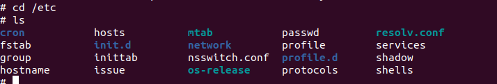
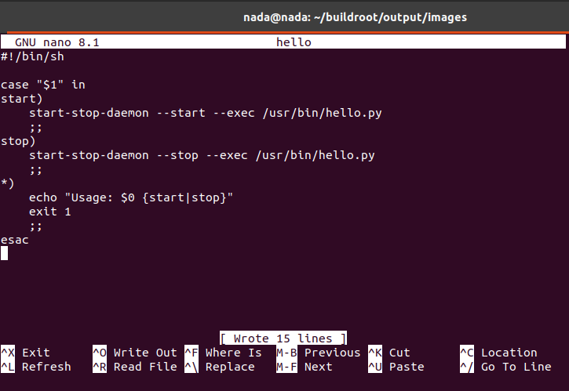
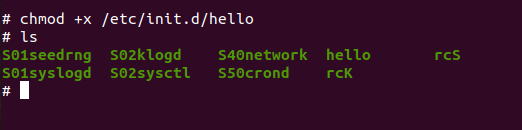
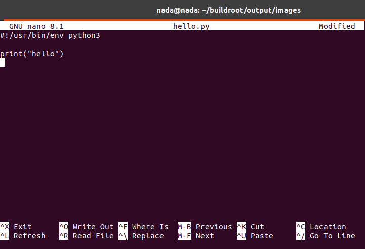
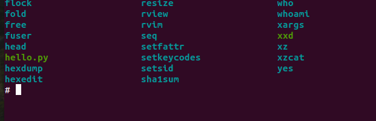
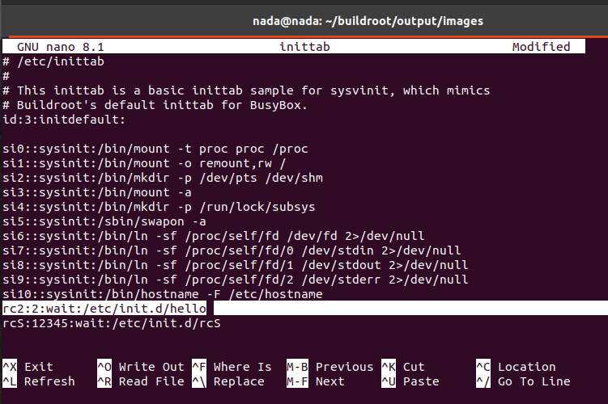
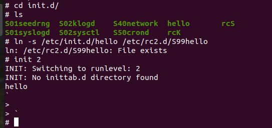

# initprocess

The first process created by the kernel is called `init`, and it branches out to other processes, forming the root of the process tree. The kernel creates the init process using `init=/sbin/init` or `init=/bin/sh`. The main aim is to have a GUI or shell to interface with the kernel, allowing communication with the OS.

## Type of Process (BusyBox)

When we run the process `/sbin/init`, it gets a configuration file as an input, which is `inittab`. At this phase, the init process parses `inittab`. The file contains:
```
#!/bin/bash
node::action:application to run
::sysinit:/etc/init.d/rcS  # (a bash script: run commands arg)
::ask_first:/bin/sh
```
This bash script mounts `proc`, `dev`, and `sys` at sysinit. As mentioned before, `etc` is a configuration file, so `inittab` would be under `/etc`. The script `initd.d` will run, and because I added the shebang, it runs a shell, opens it for this process, then closes it, allowing the process to run separately.

The line `/bin/sh` keeps the process from terminating as it serves as an entry point. The script ends with `exit 0`, but it waits until terminated, at which point `exit 0` sends an exit status. The shebang runs `/bin/bash` to execute the script.

For example, using the `adduser` application:
```bash
cat /usr/sbin/adduser | grep head
#!/bin/bash/perl
```
Any interpreted process uses a shebang.

## SystemV

### Overview

If we work with only one init process, we may need to initialize several functions, such as:
1. Bluetooth
2. WiFi

In the init process, full functionality needs to be handled by the system, not the user. Runlevels (or modes) can manage this, allowing the system to operate without a GUI, reducing CPU load during tasks like network traffic.

### Runlevels

Runlevels help manage the system's modes:
- **Runlevel 0**: Shutdown mode
- **Runlevel 1**: Single-user mode
- **Runlevel 2**: Multi-user mode without network
- **Runlevel 3**: Multi-user mode
- **Runlevel 4**: User-defined mode
- **Runlevel 5**: GUI mode
- **Runlevel 6**: Reset mode

### Scripts and Runlevels

To switch between runlevels, scripts in `/etc/init.d/` manage system applications like GUI, TFTP, NETWORK, SSH, SHELL, etc. These scripts must be written, and you can view them using:
```bash
ls /etc/init.d/
```
Configuration files exist in these directories:
- `/etc/rc1.d/` (Runlevel 1)
- `/etc/rc5.d/` (Runlevel 5)
- `/etc/rc3.d/` (Runlevel 3)

You can check your current runlevel with:
```bash
runlevel
```
And view all runlevels with:
```bash
ls rc
```
For example, to disable the network in system1:
```bash
ln -s /etc/init.d/network K01network
```
To enable SSH:
```bash
ln -s /etc/init.d/ssh S02ssh
```
The `K` and `S` denote "kill" and "start", respectively, and the numbers indicate the application's priority. Files with the same priority use alphabetical order.

### Example Script (rc.c)

A script, `rc.c`, uses switch cases for runlevels:
```c
switch(runlevel)
case 1:
    cd /etc/rc1.d/
    for(parsing(k),00)
    {
        K01GUI  // (Softlink on tftp under init.d, waits for stop argument)
    }
    for(parsing(S),00)
    {
        S01SHELL  // (Softlink on shell app under init.d, waits for start argument)
    }
```
Runlevels in embedded Linux have two modes:
1. Application mode (infotainment system, user mode)
2. Maintenance mode (OBD, service center)

Some systems may run applications on Linux with baremetal as a security device.

### SystemV Summary

1. `init=/sbin/init` takes `inittab`:
```
node:"runlevel":action:application
    :      S   :sysinit:rcS
    :      0   :wait:rc.c
    :      1   :wait:rc.c
    :      2   :wait:rc.c
    :      3   :wait:rc.c
    :      4   :wait:rc.c
    :      5   :wait:rc.c
    :      6   :wait:rc.c
```
Switching between runlevels restarts the system, going back to sysinit, which runs the specified file at startup.

By the way Linux uses SystemD, 
while Unix uses SystemV 

Now lets set up a new runlevel in Buildroot and configure it to run a script (`hello`) that starts a program (`hello.py`), follow these steps:

**First we need to setup and Configure Buildroot**
you can find that [here](https://github.com/NadaElsayed1/Embedded-Linux/blob/main/Embedded_Linux/Auto_Build_Tools/Buildroot/README.md)

Navigate to the `/etc` directory and explore its contents:

```sh
cd /etc
ls
cd /init.d
```


So as you can see:
**`init.d` Directory**: This directory contains scripts for managing run levels. The `inittab` file specifies the configuration for these run levels.

**Setting Run Levels**: Define run level configurations in `inittab`, pointing to the corresponding script in `init.d`. Finally, create a symbolic link to the main application in `/usr/bin`.

**Let's begin setting up our run level:**
### 1. **Create and Configure the Init Script**

First, create an init script in the `init.d` directory called `hello`. This script will use a switch-case to manage starting and stopping services.

#### 1.1. Create the Init Script

```sh
#!/bin/sh

case "$1" in
start)
    start-stop-daemon --start --exec /usr/bin/hello.py
    ;;
stop)
    start-stop-daemon --stop --exec /usr/bin/hello.py
    ;;
*)
    echo "Usage: $0 {start|stop}"
    exit 1
    ;;
esac
```



Save this script as `/etc/init.d/hello` and make it executable:

```sh
chmod +x /etc/init.d/hello
```



#### 1.2. Create the python Program (`hello.py`)

This program file under `/usr/bin`:

```sh
touch /usr/bin/hello.py
```

Then write the following:

```py
#!/usr/bin/env python3

print("hello")
```



2. **Make sure the Python script is executable:**:

   ```sh
   chmod +x /usr/bin/hello.py
   ```



### 2. **Create Soft Links for Runlevel 2**

In Unix-like systems, runlevels are directories that contain symbolic links to scripts in `/etc/init.d`. You will create a new directory for runlevel 2 and link the `hello` script.

```sh
mkdir /etc/rc2.d
ln -s /etc/init.d/hello /etc/rc2.d/S99hello
```

Here, `S99hello` is a soft link to the `hello` script, with `S` indicating "start" and `99` setting its order relative to other scripts.

### 3. **Update `/etc/inittab`**

Modify the `/etc/inittab` file to define the new runlevel. Add the following line to start the `hello` script when runlevel 2 is entered:

```sh
rc2:2:wait:/etc/init.d/hello
```



This tells the system to run `/etc/init.d/hello` when entering runlevel 2.

### 4. **Test the New Runlevel**

To test the setup, switch to runlevel 2:

```sh
init 2
```



## SystemD

SystemD initializes the system sequentially, not in parallel. For example, if only Bluetooth is needed, SystemD waits for other processes, increasing CPU load.

SystemD's init process is located in:
```bash
/sbin/init -> /lib/systemd/system
```
Main directories:
- `/etc`: Edit part
- `/etc/systemd/system/`: Unit files
- `/lib/systemd/system/`: Unit files

SystemD uses units for services, mounts, networks, automounts, sockets, etc.

In SystemD, the concept of a **unit** is central to managing system processes. Units represent resources or services managed by SystemD and are defined by specific files.

@admin linux2, units include:

1. **Service**: Represents a service, typically a daemon that runs in the background without user interaction. Examples include web servers, databases, etc.
2. **Mount**: Defines a mount point for a filesystem. It is used to mount applications or filesystems during system startup.
3. **Network**: Configures network settings, such as setting IP addresses or managing network interfaces.
4. **Automount**: Automates the mounting of filesystems. It is typically paired with a mount unit to automatically mount the filesystem when it is accessed.
5. **Socket**: Manages socket-based communication, such as network ports. It can start a service when a connection is made to a specific socket.

Each unit type has its own configuration file and specific way of being written, providing flexibility and control over system resources and services.