# Booting Kernel with Root Filesystem

Welcome to the Embedded Linux series! This task provides detailed instructions on how to boot a Linux kernel using initramfs. (i should makesure that i compiled the busybox statically)
first why we need to do that at first before booting on rootfs with is at ext4 by the way.
as nearly we would use that to create (recovery boot) as we need to make 2 rootfs to act as 2 banks for booting which advance to me:  
1- execution process faster
2- for security
3- flash in 2 banks
The process includes coping content of the rootfs at initramfs the then archiving it as converit to an image using (mkimage) to be apple to passing it to qemu, finally booting with this image.

## Steps
1- create init ram file system directory at ~/Desktop/Tools
```sh
mkdir initramfs
```
2- coping the content of our rootfs at initramfs directory
```sh
sudo cp -rp /media/nada/rootfs/* ~/Desktop/Tools/initramfs
```
then as we did with rootfs change the owner to root
```sh
 sudo chown -R root:root *
```
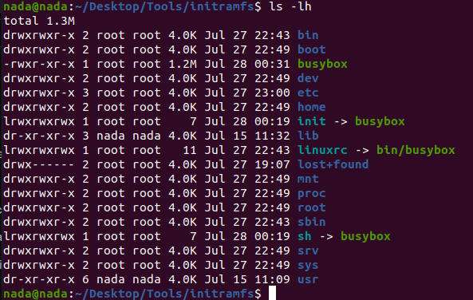
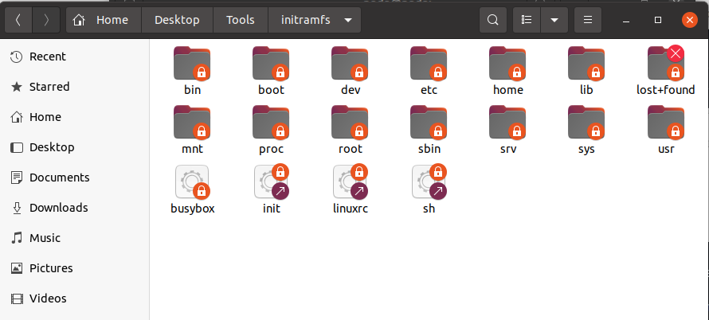

now let's compress all allocated files using cpio to move them to RAM as they were at harddisk (for faster execution)
the i will compress them else using xz as(we configured kernel to use xz compression)

so let's compress them as 1st compression with this command:
```sh
find . | cpio -H newc -ov --owner root:root > ../initramfs.cpio
```
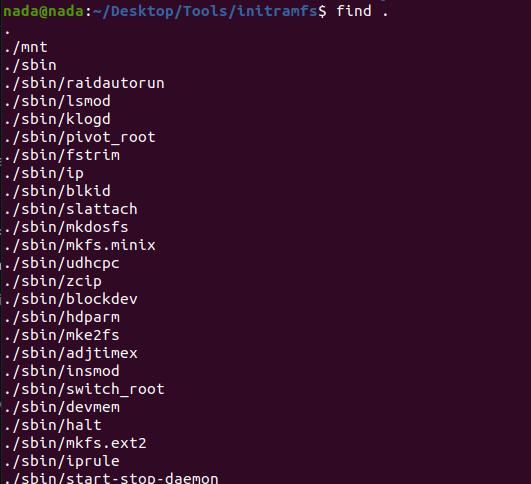
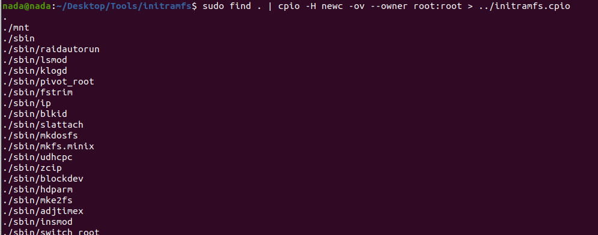

then the 2nd commpression:

```sh
cd .. 
gzip initramfs.cpio
```
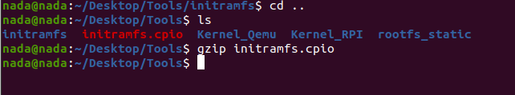
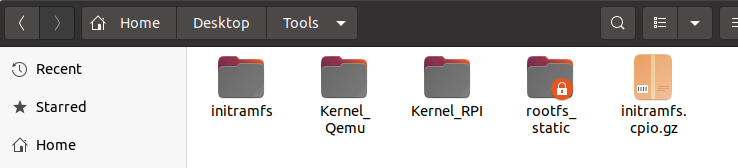

now let's convert this file to an image to be able to use it at qemu:
```sh
mkimage -A arm -O linux -T ramdisk -d initramfs.cpio.gz myRAMfs
```
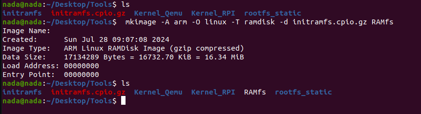

let's move this image to boot partation:
```sh
 sudo cp RAMfs /media/nada/boot/
```
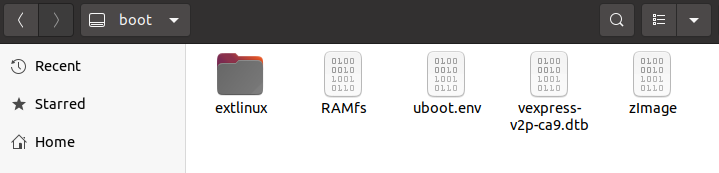

now let's run qemu
```sh
sudo qemu-system-arm -M vexpress-a9 -m 128M -nographic -kernel u-boot -sd /home/nada/sd.img -net tap,script=./qemu_ifup -net nic
```
let's boot with initramfs
```sh
setenv ramdisk_addr 0x60900000
fatload mmc 0:1 $kernel_addr_r zImage
fatload mmc 0:1 $fdt_addr_r vexpress-v2p-ca9.dtb
fatload mmc 0:1 $ramdisk_addr myRAMfs
setenv bootargs console=ttyAMA0 rdinit=/bin/sh

saveenv
bootz $kernel_addr_r $ramdisk_addr $fdt_addr_r
```
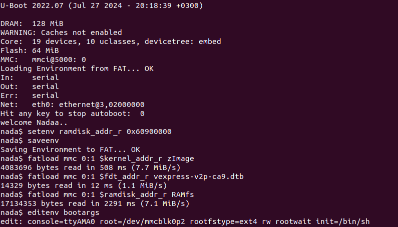
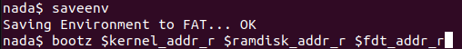
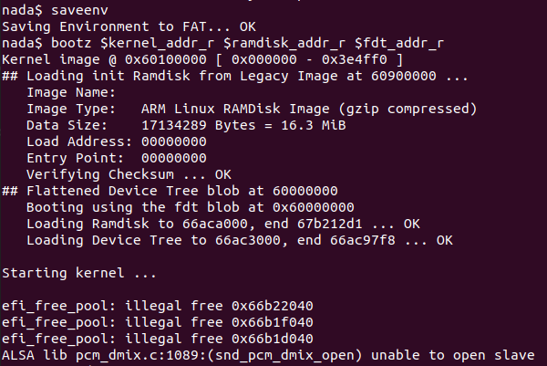
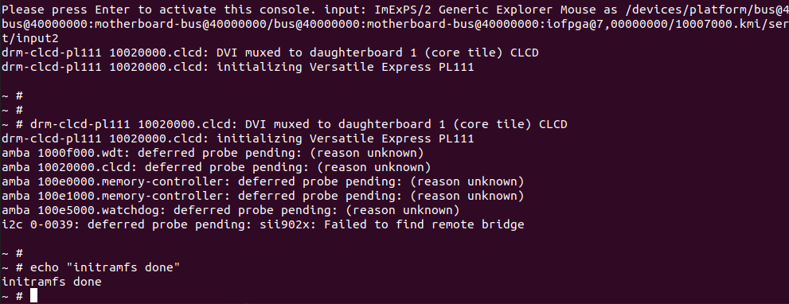


