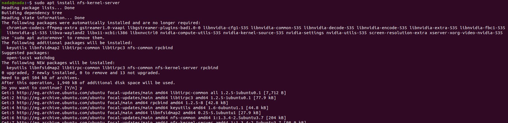
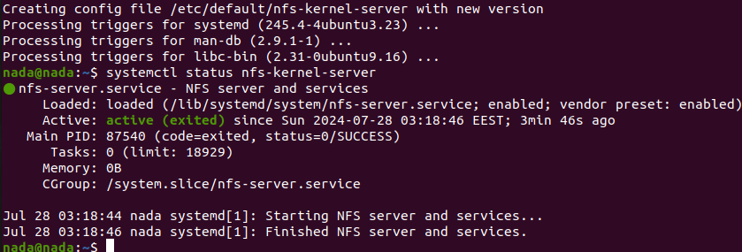
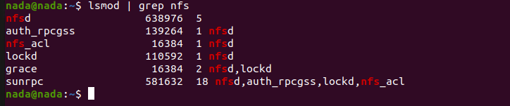
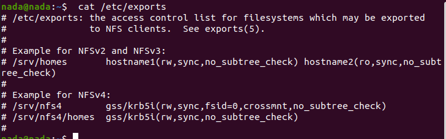
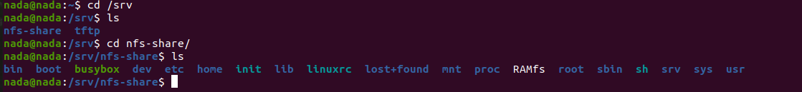
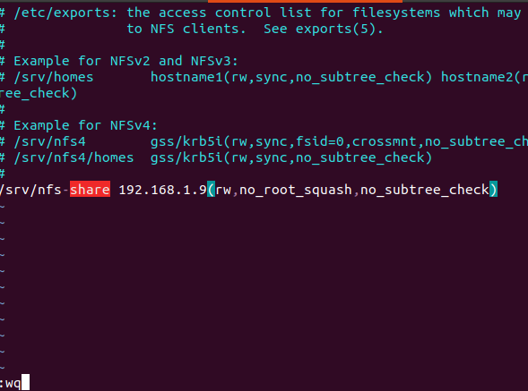
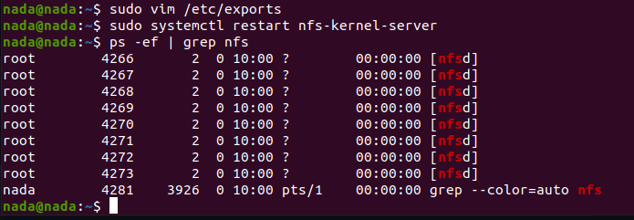
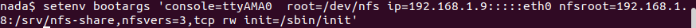
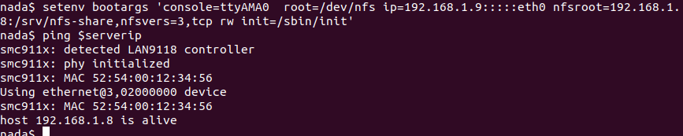
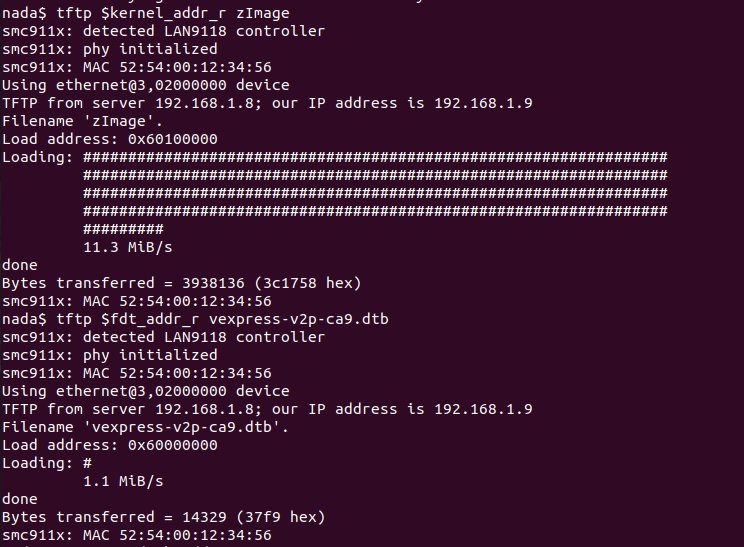

# Booting Kernel with NFS

Welcome to the Embedded Linux series! This task provides detailed instructions on how to boot a Linux kernel using Network File System (NFS) on Ubuntu. This process involves installing NFS, configuring the NFS server, and setting up the environment to boot the kernel using NFS with QEMU.

## Steps

### 1. Install NFS on Linux (Ubuntu)

Install the NFS package:
```sh
sudo apt install nfs-kernel-server
```


### 2. Verify NFS Installation

Check if NFS was installed successfully:
```sh
systemctl status nfs-kernel-server
```


Ensure that the NFS kernel modules are loaded:
```sh
lsmod | grep nfs
```


### 3. Configure the NFS Server

After installation, the NFS server configuration is stored in the `/etc/exports` file. This file contains the directories to be shared by the server.

Initially, no directories are exported. You can view the NFS configuration file with:
```sh
cat /etc/exports
```


### 4. Mount the Root Filesystem through the NFS Server

We previously created a dynamic root filesystem. We will place this rootfs on the server.

1. Create a directory under `/srv` called `nfs-share`:
   ```sh
   sudo mkdir /srv/nfs-share
   ```
    Now move files from rootfs to nfs-share:
    ```sh
    sudo cp -rp /media/nada/rootfs/* /srv/nfs-share
    ```
    

2. Ensure there is no device connected with the target IP address, and you can use this IP for QEMU.

3. Open `/etc/exports` with vim:
   ```sh
   sudo vim /etc/exports
   ```

4. Configure the NFS file `/etc/exports` by adding this line inside the file:
   ```sh
   /path/to/rootfs  client_IP(rw,sync,no_subtree_check)
   ```
   In my case:
   ```sh
   /srv/nfs-share 192.168.1.9(rw,no_root_squash,no_subtree_check)
   ```



5. Refresh the exports configuration file to update it:
   ```sh
   sudo systemctl restart nfs-kernel-server
   ```



### 5. Run QEMU

Set up the QEMU environment and boot with NFS:
```sh
sudo qemu-system-arm -M vexpress-a9 -m 128M -nographic -kernel u-boot -sd /path/to/sd.img -net tap,script=./qemu_ifup -net nic
```

### 6. Set Environment Variables and Boot

In the QEMU console, set the environment variables:
```sh
setenv serverip 192.168.1.8
setenv ipaddr 192.168.1.9
setenv bootargs 'console=ttyAMA0 root=/dev/nfs ip=192.168.1.9:::::eth0 nfsroot=192.168.1.8:/srv/nfs-share,nfsvers=3,tcp rw init=/sbin/init'
```
Load the kernel and device tree files, then boot:
```sh
fatload mmc 0:1 $kernel_addr_r zImage
fatload mmc 0:1 $fdt_addr_r vexpress-v2p-ca9.dtb
bootz $kernel_addr_r - $fdt_addr_r
```




