# Booting Kernel with Root Filesystems

This README provides detailed instructions on how to boot a Linux kernel using two root filesystems (`rootfs1` and `rootfs2`). The initramfs script prompts the user to select which root filesystem to boot. The process includes downloading and configuring BusyBox, running the system on QEMU, and starting the kernel.

## Prerequisites

Ensure you have the following installed:
- QEMU
- BusyBox source code
- U-Boot
- Cross-compiler toolchain for ARM (e.g., `arm-cortex_a8-linux-musleabi`)
- NFS server for root filesystems (optional)

## Steps

### 1. Download and Configure BusyBox

1. Clone the BusyBox repository:
   ```sh
   git clone https://github.com/mirror/busybox.git
   cd busybox
   ```
   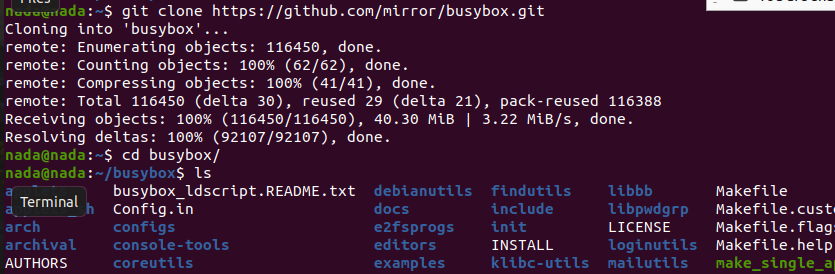

2. Configure your cross-compiler and the target architecture:
   ```sh
   export CROSS_COMPILE=path/to/compiler/arm-cortexa9_neon-linux-musleabihf-
   export ARCH=arm
   ```
   
3. Set up the build configuration:
   ```sh
   make menuconfig
   ```
   In the menu, ensure you build a static binary (no shared libs). Navigate to Settings -> Build static binary.
   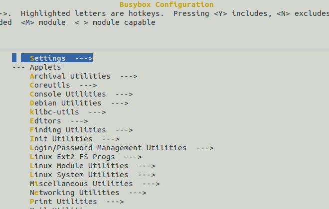
   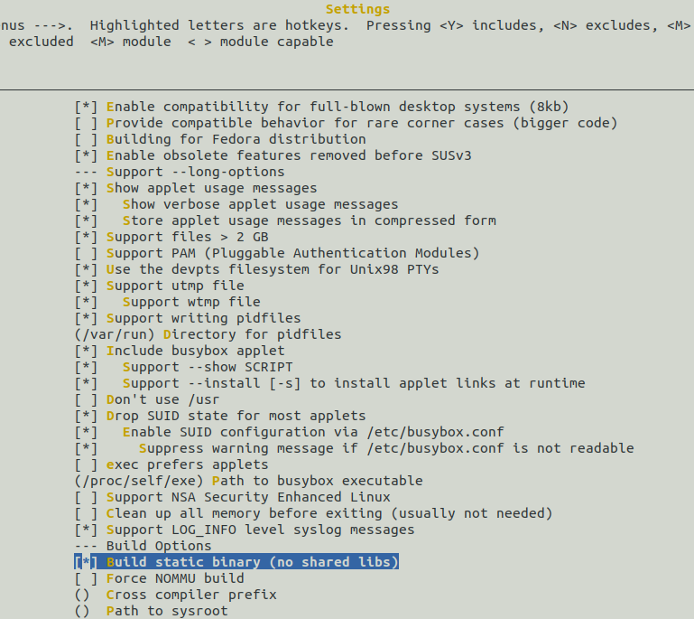

4. Build BusyBox:
   ```sh
   make
   ```
   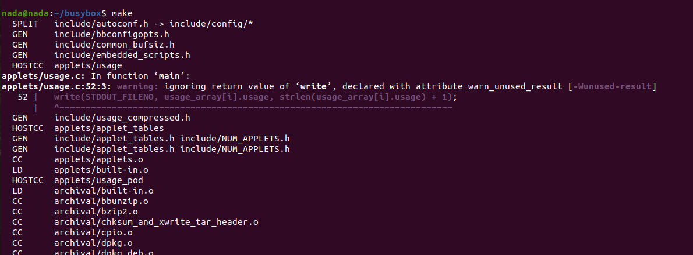

5. Install BusyBox:
   ```sh
   make install
   ```
   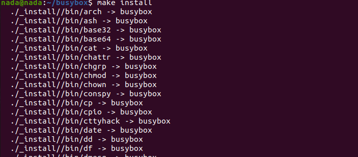
   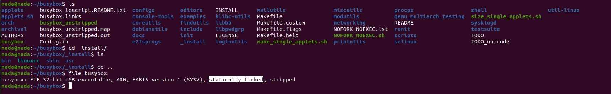

   The `_install` directory contains the installation files, which is the destination path for `make install`.

6. Verify the binary:
   ```sh
   file busybox
   ```
   It should be statically linked.

### 2. Create Root File System (rootfs) for Embedded Linux Target

1. Create the root filesystem directory and copy BusyBox files:
   ```sh
   mkdir ~/rootfs_Static
   rsync -av ~/busybox/_install/* ~/Desktop/Tools/rootfs_Static/
   cd ~/Desktop/Tools/rootfs_Static/
   ```

2. Create additional necessary directories:
   ```sh
   mkdir boot dev etc home mnt proc root srv sys
   ```

3. Create a startup script called `rcS` in `etc/init.d/` and the `inittab` file in `etc`:
   ```sh
   touch etc/inittab
   mkdir etc/init.d
   touch etc/init.d/rcS
   ```
   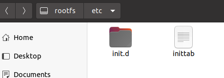
   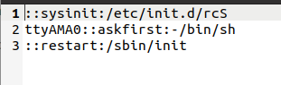

4. Write the `inittab` script:
   ```sh
   # When system startup, it runs the script "rcS"
   ::sysinit:/etc/init.d/rcS
   # Ask the user to press any key before running /bin/sh
   ttyAMA0::askfirst:-/bin/sh
   # When restarting the init process, execute "init"
   ::restart:/sbin/init
   ```

5. Write the `rcS` file and make it executable:
   ```sh
   vim etc/init.d/rcS
   chmod +x etc/init.d/rcS
   ```
   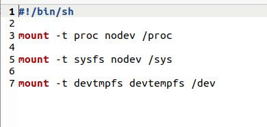

   Content of `rcS`:
   ```sh
   #!/bin/sh
   # Mount the proc filesystem
   mount -t proc nodev /proc
   # Mount the sysfs filesystem
   mount -t sysfs nodev /sys
   # Mount devtmpfs if not configured in Kernel menuconfig
   mount -t devtmpfs devtmpfs /dev
   ```

### 3. Configure Softlinks and Permissions

1. Create softlinks to the BusyBox executable:
   ```sh
   sudo cp busybox /media/nada/rootfs
   cd /media/nada/rootfs 
   ln -s busybox init
   ln -s busybox sh
   ```
   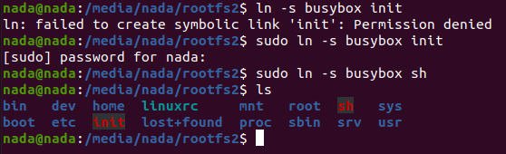
   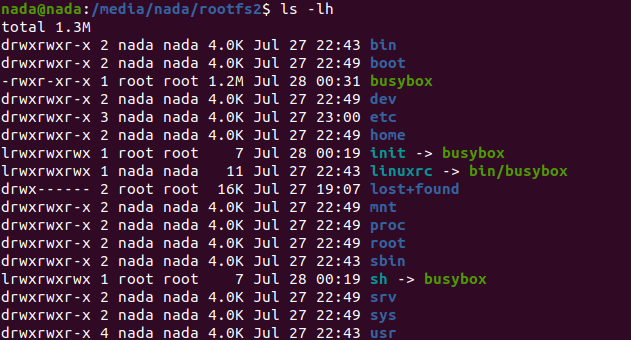

2. Ensure all files are owned by the root user:
   ```sh
   chown -R root:root /path/to/directory
   # In my case
   sudo chown -R root:root ~/Desktop/tools/rootfs_Static
   ```

### 4. Copy Kernel Modules to rootfs_Static

1. Copy dynamic kernel modules to `rootfs_Static`:
   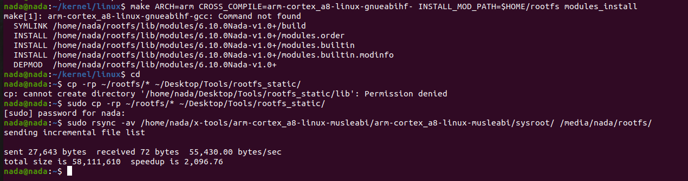
   
   Use `rsync` to append the generated rootfs to `rootfs_Static`:
   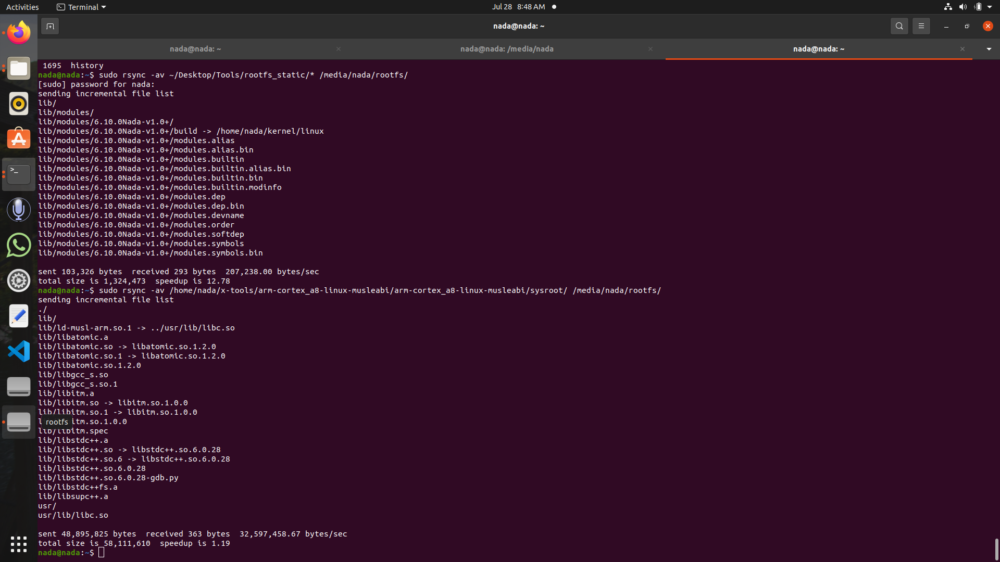

### 5. Boot the System with QEMU

1. Run QEMU:
   ```sh
   sudo qemu-system-arm -M vexpress-a9 -m 128M -nographic -kernel u-boot -sd /home/nada/sd.img -net tap,script=./qemu_ifup -net nic
   ```

2. Set the `bootargs` environment variable to avoid kernel panic:
   ```sh
   setenv bootargs 'console=ttyAMA0 root=/dev/mmcblk0p2 rootfstype=ext4 rw rootwait init=/sbin/init'
   saveenv
   ```

3. Load the kernel and device tree, then boot:
   ```sh
   fatload mmc 0:1 $kernel_addr_r zImage
   fatload mmc 0:1 $fdt_addr_r vexpress-v2p-ca9.dtb
   bootz $kernel_addr_r - $fdt_addr_r
   ```

   Alternatively, use the `bootflow scan` command:
   ```sh
   bootflow scan
   ```
   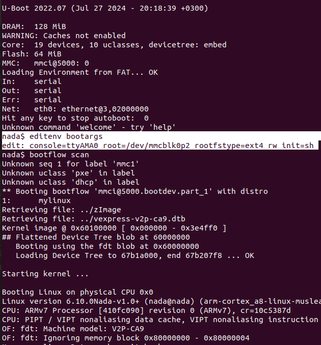
   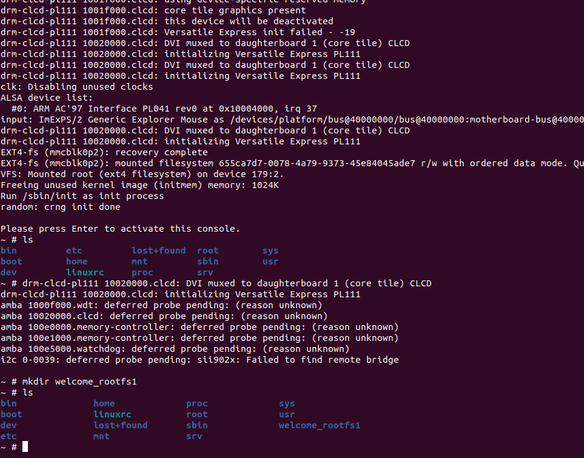
   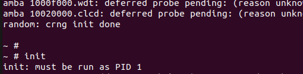

   Note: If you encounter the error "init: must be run as PID", this message is generated by the init process itself, not the shell.
