## Introduction
Welcome to the Embedded Linux series! This task involves setting up and configuring the Linux kernel for ARM architecture, including creating and managing users and groups using Bash scripts. Below, I provide detailed instructions for each step, covering kernel components, device tree files, kernel configuration, and compression methods, along with the necessary commands and configurations to ensure a smooth setup process.

### Kernel Overview
Linux consists of two main components: `zImage` and `file.dtb`.

**zImage**: This is the compressed image of the compiled Linux kernel source code.

**file.dtb**: This file is a Device Tree Blob, which describes the hardware connections outside of the CPU. It details all the registers outside the CPU on the SoC (System on Chip) and the remaining peripherals on the board. Essentially, it provides addresses and registers for all peripherals connected to the SoC and the board.

In previous Linux versions, such as Linux 1 and 2, there wasn't a `file.dtb`. Each architecture board had its own version of Linux, written specifically for it. When writing drivers under Linux, physical addresses were used directly, a method called "board-specific."

In modern Linux generations, the approach has shifted. Now, Linux is divided into two sections:

1. **Logic Part (zImage)**: This part contains the generic logic to run Linux based on the architecture used. It holds variables related to address mapping but not the actual values, as these will connect to the `file.dtb`.
   
2. **Hardware Description (file.dtb)**: This file contains the actual register values and addresses specific to your board.

This division allows Linux to be architecture-based rather than board-specific. With this approach, you only need one source code, and the `dtb` files are the only components that change based on the specific board.

This new method provides a more modular and flexible way to handle different hardware configurations without modifying the core kernel logic, streamlining the process of adapting Linux to various architectures.

### What is DTS, DTC, DTB:

**DTS**: Device Tree Source
- **Description:** A human-readable text file that describes the hardware components of a system. It contains addressable nodes and properties for each peripheral and device.
- **Example:** Describes CPUs, memory, buses, and peripherals.

**DTC**: Device Tree Compiler
- **Description:** A tool that converts the human-readable DTS files into binary format. It takes a DTS file as input and produces a DTB file.

**DTB**: Device Tree Binary
- **Description:** A binary file generated from a DTS file using the DTC. It is used by the Linux kernel to understand the hardware layout of the system during boot time.
- **Example:** The kernel reads the DTB file to configure the hardware correctly.

## Now let's dive into the kernel installation

1. Clone the kernel source:
   ```sh
   mkdir kernel
   cd kernel
   ```
   ```sh
   git clone --depth=1 git://git.kernel.org/pub/scm/linux/kernel/git/stable/linux.git
   ```
   `--depth=1` means to retrieve only the most recent commit, not the entire history. Then `cd linux`

2. Then let's run Make to configure the Vexpress a9
   ```sh
   make vexpress_defconfig
   ```
   Navigate to `cd /linux/arch/arm/configs` and choose the board, which is `vexpress_defconfig`. Then go back to the Linux directory `cd ~/kernel/linux`.

   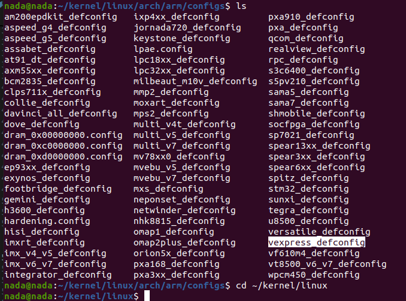
   
   If you run `make vexpress_defconfig`, you will get an error *can't find default configuration*. This is because it is looking in the wrong place (arch/x86/configs/vexpress instead of arch/arm). 
   
   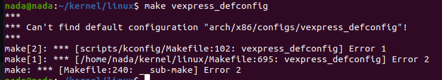

   So, set the environment variables:
   ```sh
   export ARCH=arm
   export CROSS_COMPILE=~/x-tools/arm-cortexa9_neon-linux-musleabihf/bin/arm-cortexa9_neon-linux-musleabihf-
   ```
   Now you can run `make vexpress_defconfig`.
   
   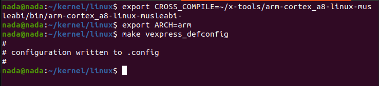

3. Configure the kernel:
   ```sh
   make menuconfig
   ```
   Let's configure our kernel:
   1. Go to General Setup -> Kernel Compression Mode
   
      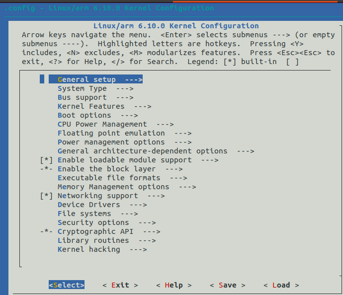
      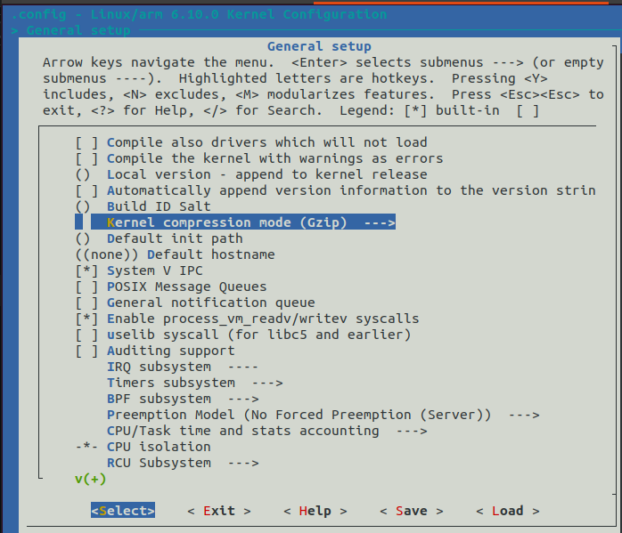

      As you see, there are many types of compression, and we will choose xz. Let's know more about it. Write a question mark `?` or choose help at xz:
      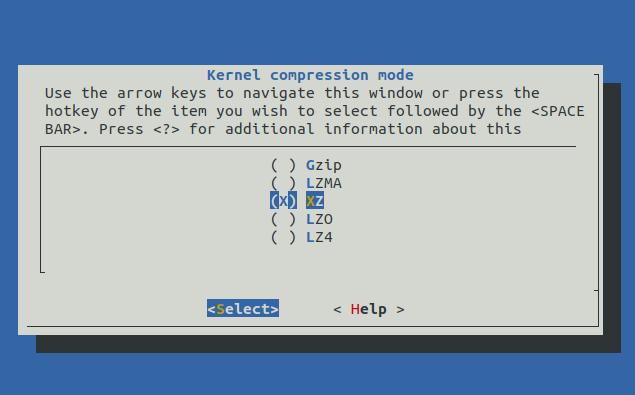
      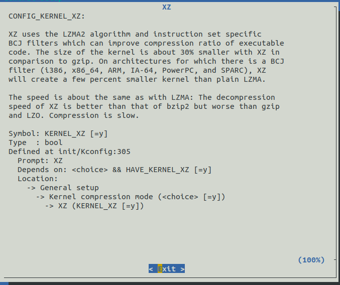

      - It says that the kernel is about 30% smaller in size compared to gzip, but at the endpoint in RAM, it's the same.
      - During decompression, xz is better than LZMA and worse than gzip.
      - In terms of speed, it's equal to LZMA.
      
      So, finally, I can pick a specific compression method to make Linux boot faster depending on my CPU and RAM. For example, when the CPU is faster and RAM is slower, I will use gzip to generate a compressed image, as the CPU can compress and then pass a smaller image to RAM. If the opposite is true, where the CPU is slower and RAM is faster, it's better to use an uncompressed image. This is because, in this case, the CPU will be slower to compress, so I need to pick a method that minimizes CPU load and takes advantage of the faster RAM. Therefore, for slower CPUs and faster RAM, using an uncompressed image or a compression method with lower CPU overhead, such as LZ4, is recommended. LZ4 provides fast decompression speeds and is lightweight on CPU usage, making it ideal for scenarios where CPU performance is limited but RAM performance is not.

      Finally, the command I use to decompress the action of xz is `bootz`.

   2. Go back to General Setup -> Initial RAM filesystem and RAM disk (initramfs/initrd) support (make sure it's selected)
      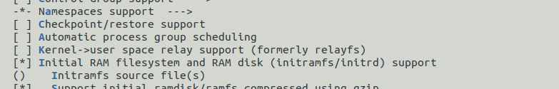
      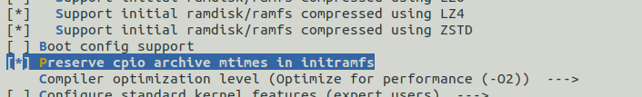
      
      Now the kernel will go to RAM to decompress itself. The kernel knows it has arrived in RAM by the `bootz` command sent to U-Boot.

   3. Go to File Systems -> select ext4. Linux is built on a filesystem type ext4, not FAT.
      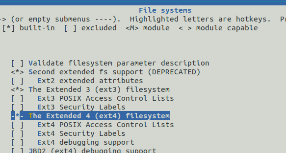

   4. Search for devtmpfs using `/`

      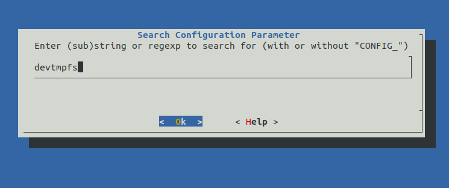

      Press 1 at the selected line
      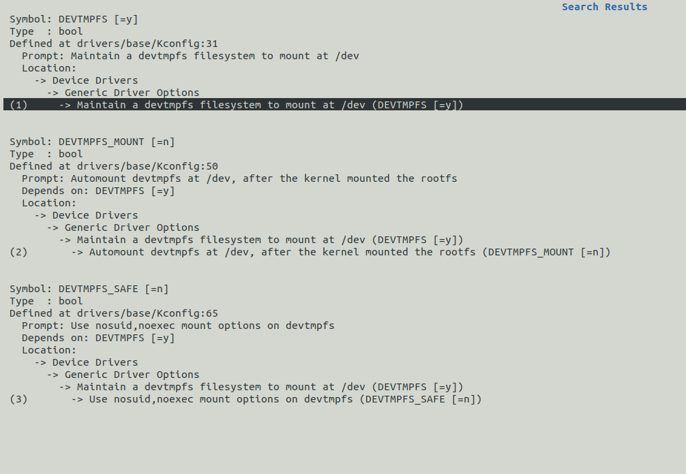

      devtmpfs is a virtual filesystem that the kernel creates to allow userspace access to virtual devices. Ensure that the option for devtmpfs being automounted is "not selected" as we will do the mounting ourselves.

      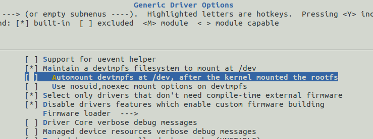

   5. Change your kernel local version to your name and append on it -v1.0
      For example, my kernel name is "Nada-v1.0"
      so go back to general setup -> Local version - append to kernel release
      
      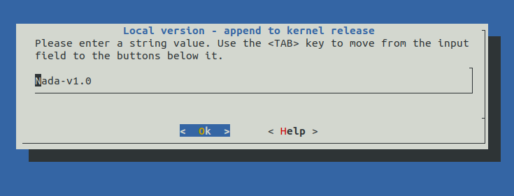
      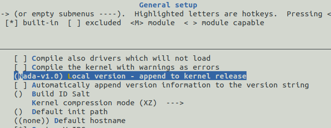

   6. Finally, save the changes.

4. Now, let's run `make -j4` :
   - `-j4`: This flag specifies the number of concurrent jobs to run. Using `-j4` means the build process will utilize four parallel jobs, which speeds up the compilation. Running multiple jobs concurrently can greatly reduce the build time.

   - Note: Each CPU core can handle two jobs simultaneously. In this case, the computer has four cores—two are dedicated to the build process, and the other two are reserved for the Linux OS. To find out the number of cores on your system, use the command:
   
   - `zImage`: This target builds a compressed kernel image known as zImage. This image is the primary executable that the bootloader loads into memory.

   - `modules`: This target compiles the loadable kernel modules. These modules are additional pieces of code that can be loaded into or unloaded from the kernel dynamically, adding extra functionality.

   - `dtbs`: This target compiles the device tree blobs (DTBs). The device tree is a data structure that provides a detailed description of the hardware board.
   
   ```sh
   make -j4 zImage modules dtbs
   ```
   
   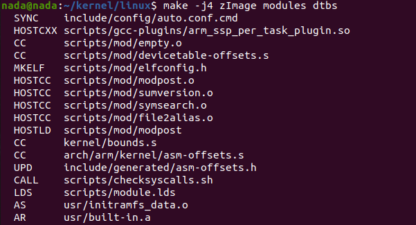

   At the end, it will create the zImage. You may not see it in the `/linux` directory, but you can find it by running `ls /linux/arch/arm/boot`. Here you will find `Image` and `zImage`. You can also see `vmlinux`, which is the compiled source code (binary Linux). This file includes debugging symbols and the symbol table, so its size is very large. To see its size, run:
   
   ```sh
   du -sh vmlinux
   ```
   
   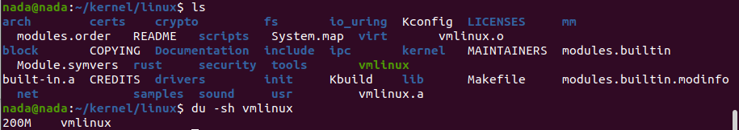

   All 200M stored in RAM.

   Compare the sizes of `Image` and `zImage`:
   ```sh
   du -sh Image
   du -sh zImage
   ```
   
   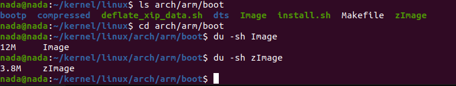

   We can conclude that one of them is compressed

 (`zImage`, which is self-compressed) and the other is not. If you want to boot using `Image`, use the `booti` command.

   You can find the `file.dtb` at:
   ```sh
   cd ~/kernel/linux/arch/arm/boot/dts/arm
   ```

   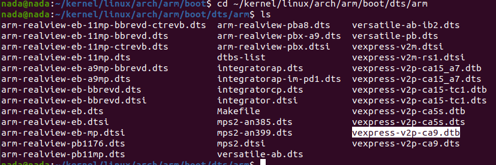

   Now, we need to copy the files to the TFTP folder. In my case:
   ```sh
   cd ~
   sudo cp kernel/linux/arch/arm/boot/zImage /srv/tftp
   sudo cp kernel/linux/arch/arm/boot/dts/arm/vexpress-v2p-ca9.dtb /srv/tftp
   ```

   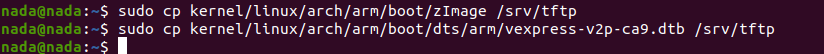

   If your `file.dtb` doesn't exist, you can run `make dtbs`.

   Now, what happens is our kernel goes to a specific part of RAM, and our `file.dtb` is loaded to another part of RAM. The `bootz` command maps them to each other, as the kernel alone cannot work without the `file.dtb`.
