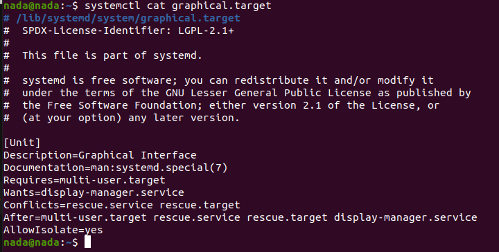
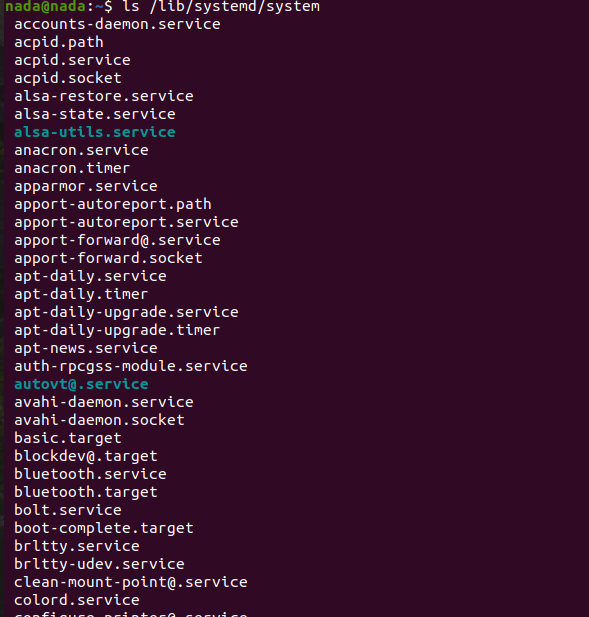
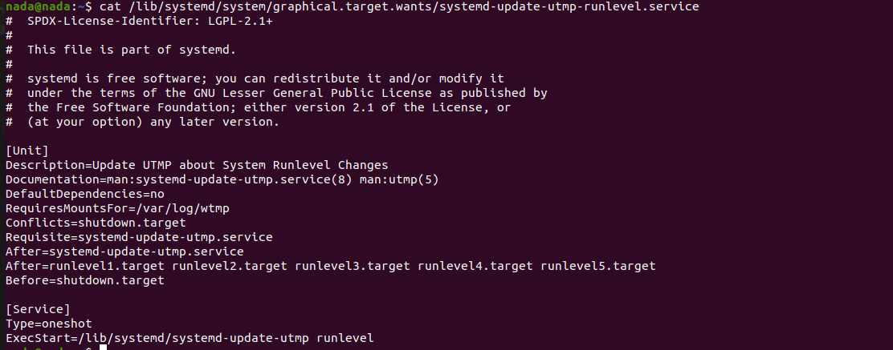
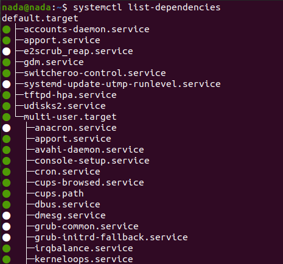

# Systemd and Custom Service Management

## Overview

Systemd is a system and service manager for Linux operating systems. It is responsible for initializing the system and managing system services. This README explains the different types of processes managed by systemd, the various unit types, and how to create and manage a custom service.

## Types of Processes

1. **Foreground Process:**
   - **Description:** A foreground process runs in the terminal and allows user interaction. It is typically the primary process in a terminal session.
   - **Example:** Running an interactive command-line tool directly in the terminal.

2. **Background Process:**
   - **Description:** A background process runs without direct user interaction and operates in the background. It can be started from the foreground and later moved to the background.
   - **Example:** Running a long-running script or application using `&` in the command line.

3. **Orphan Process:**
   - **Description:** An orphan process occurs when its parent process is terminated. The init process (PID 1) adopts the orphan process.
   - **Example:**
     ```
     ------------
     |     1    |    (Init process)
     ------------
          |
     ------------
     |     2    |    (Parent process)
     ------------
          |
     ------------
     |     3    |    (Child process)
     ------------
     ```
     If process 2 is killed, process 3 becomes an orphan and is adopted by the init process (1).

4. **Zombie Process:**
   - **Description:** A zombie process has completed execution but still has an entry in the process table. This happens when the parent process has not yet acknowledged its termination.
   - **Impact:** It holds onto a process ID and system resources, leading to potential resource leakage.

5. **Daemon Process:**
   - **Description:** A daemon process runs in the background without user interaction and often performs system tasks or services.
   - **Example:** Services like web servers or system daemons.
   - **View Running Daemons:** You can use the `jobs` command to see background jobs.

## Unit Types in Systemd

Systemd manages various types of units. Here are some common unit types:

- **Service:** Defines a service to be managed by systemd.
- **Mount:** Manages filesystem mounts.
- **Automount:** Manages automount points.
- **Socket:** Defines socket activation for services.
- **Target:** Groups units for specific states.
- **Network:** Manages network configurations.

## Writing a Service Unit File

### Header Section

- **[Unit]**
  - `Description:` Provides a brief description of the unit.
  - `Documentation:` Links to documentation related to the unit.
  - `SourcePath:` Specifies the source path for the unit.
  - `Before:` Specifies units to be started before this unit.
  - `After:` Specifies units to be started after this unit.
  - `Wants:` Indicates optional dependencies that should be started if possible.
  - `Requires:` Indicates mandatory dependencies that must be started.

### Service Section

- **[Service]**
  - `Type:` Specifies the process start-up type. Types include:
    - `simple:` The service starts a single process, and its lifecycle is tied to the service.
    - `forking:` The service forks a process and detaches from the parent process.
    - `one-shot:` Executes a single task and then exits.
  - `ExecStart:` Command to start the service.
  - `ExecStop:` Command to stop the service.
  - `WorkDir:` Sets the working directory for the service.
  - `Restart:` Defines restart behavior (`on-failure`, `always`, etc.).
  - `RestartSec:` Specifies the time to wait before restarting the service.

### Install Section

- **[Install]**
  - `WantedBy:` Defines the target under which the service should be started. For example, `multi-user.target` or `graphical.target`.

## Example

### Creating a Service

1. **Create the Service Unit File:**

   ```sh
   sudo vim /etc/systemd/system/myservice.service
   ```

   **Contents of `myservice.service`:**

   ```ini
   [Unit]
   Description=My Custom Service
   Requires=tftpd-hpa.service

   [Service]
   ExecStart=/home/nada/app/a.out
   # Restart=always

   [Install]
   WantedBy=multi-user.target
   ```

2. **Write and Compile the Application:**

   **Create and edit the application file:**

   ```sh
   mkdir -p /home/nada/app
   touch /home/nada/app/hello.c
   nano /home/nada/app/hello.c
   ```

   **Content of `hello.c`:**

   ```c
   #include <stdio.h>
   #include <unistd.h>
   #include <signal.h>

   volatile int keepRunning = 1;

   void intHandler(int dummy) {
       keepRunning = 0;
   }

   int main() {
       printf("hello\n");
       fflush(stdout);

       signal(SIGINT, intHandler);

       while (keepRunning) {
           sleep(1);
       }

       printf("Exiting...\n");
       fflush(stdout);
       return 0;
   }
   ```

   **Compile the application:**

   ```sh
   gcc /home/nada/app/hello.c -o /home/nada/app/a.out
   ```

3. **Manage the Service:**

   - **Reload systemd Configuration:**

     ```sh
     sudo systemctl daemon-reload
     ```

   - **Enable the Service:**

     ```sh
     sudo systemctl enable myservice.service
     ```

   - **Start the Service:**

     ```sh
     sudo systemctl start myservice.service
     ```

   - **Check the Service Status:**

     ```sh
     sudo systemctl status myservice.service
     ```

   - **Disable and Re-enable the Service:**

     ```sh
     sudo systemctl disable myservice.service
     sudo systemctl enable myservice.service
     ```

4. **Controlling Dependencies:**

   - **Stop the Dependency Service:**

     ```sh
     sudo systemctl stop tftpd-hpa.service
     ```

   - **Restart and Check Status:**

     ```sh
     sudo systemctl restart myservice.service
     sudo systemctl status tftpd-hpa.service
     ```

## Systemd Commands

- **`systemctl start <unit>`**: Starts the specified unit.
- **`systemctl stop <unit>`**: Stops the specified unit.
- **`systemctl cat <unit>`**: Displays the full content of the unit file, including any drop-ins.
- **`systemctl edit <unit>`**: Opens the unit file for editing.

## Visual Examples

- **View `graphical.target`:**

  ```sh
  systemctl cat graphical.target
  ```

  

- **List Units:**

  ```sh
  ls /lib/systemd/system/
  ```

  

- **List Dependencies:**

  ```sh
  ls /lib/systemd/system/graphical.target.wants/
  ```

  

- **View Service Details:**

  ```sh
  cat /etc/systemd/system/myservice.service
  ```

  

- **List All Dependencies:**

  ```sh
  systemctl list-dependencies
  ```

  
